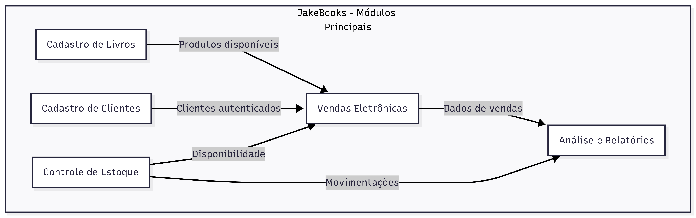
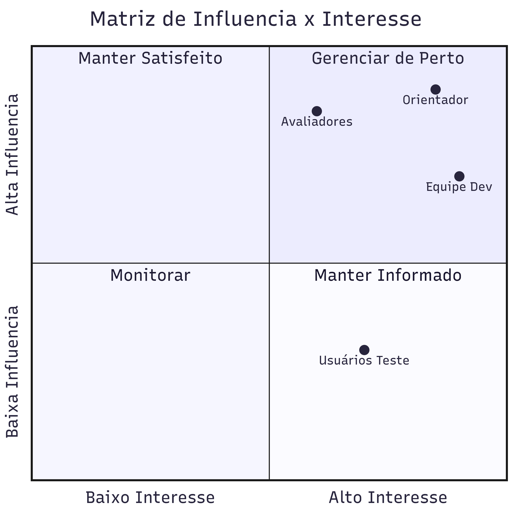
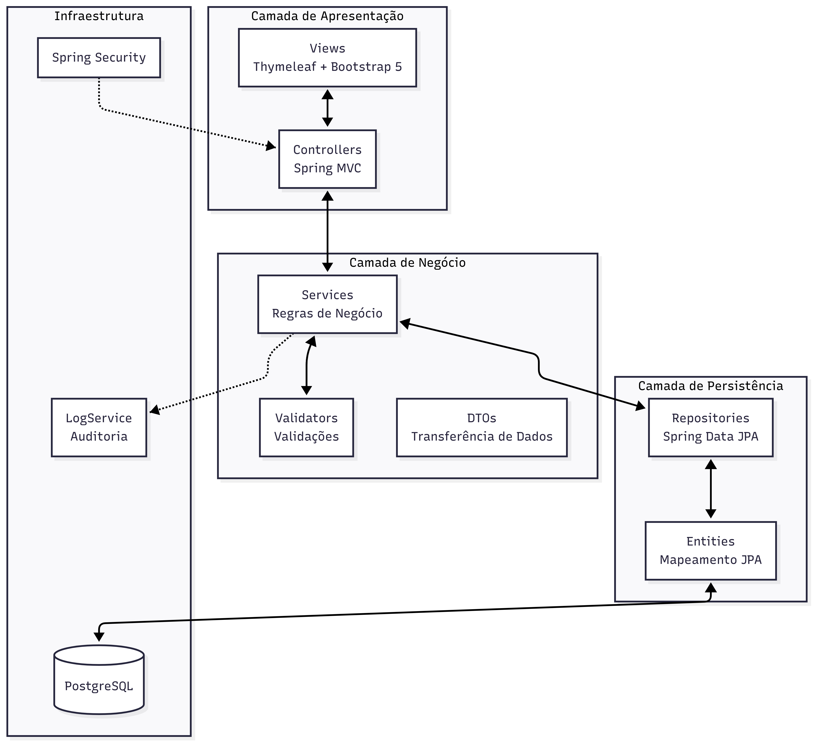
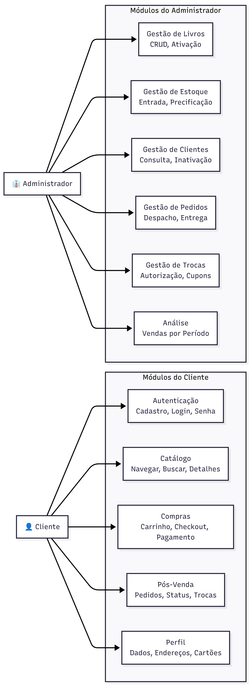
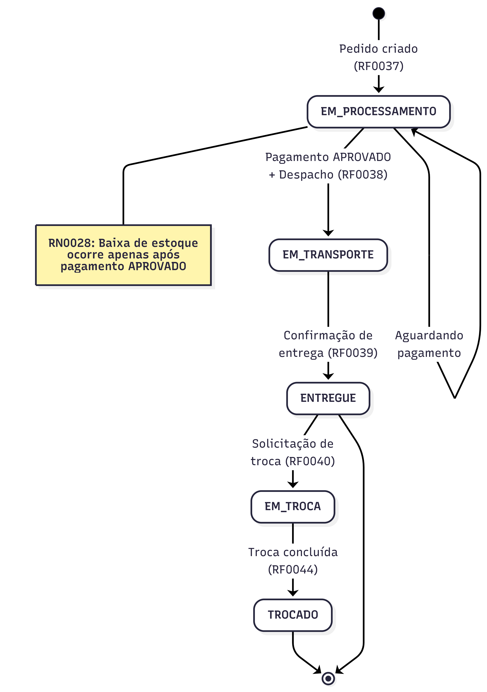
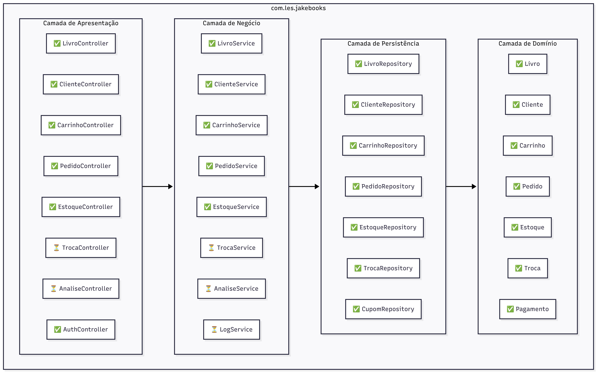
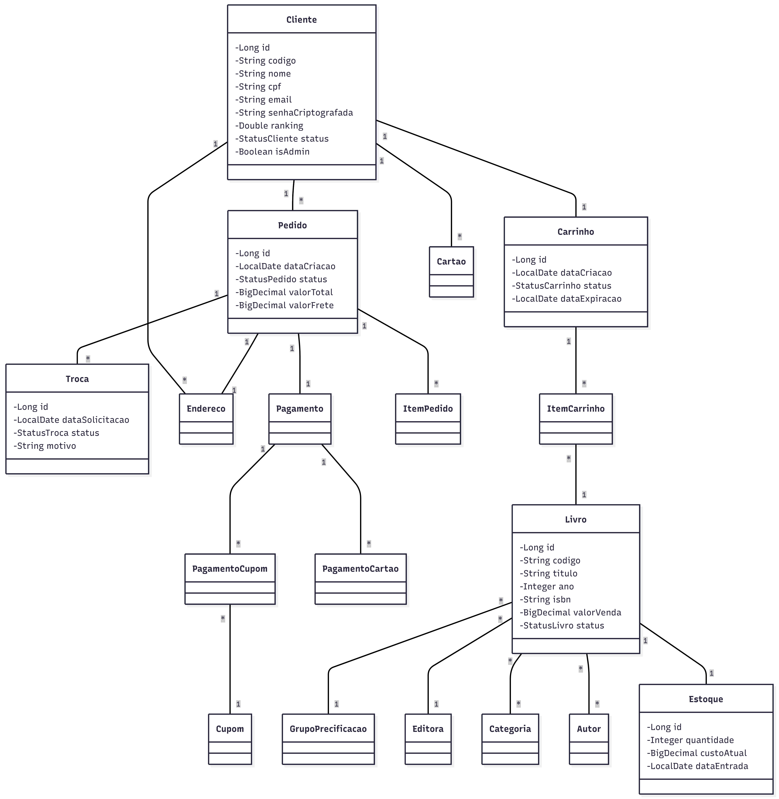
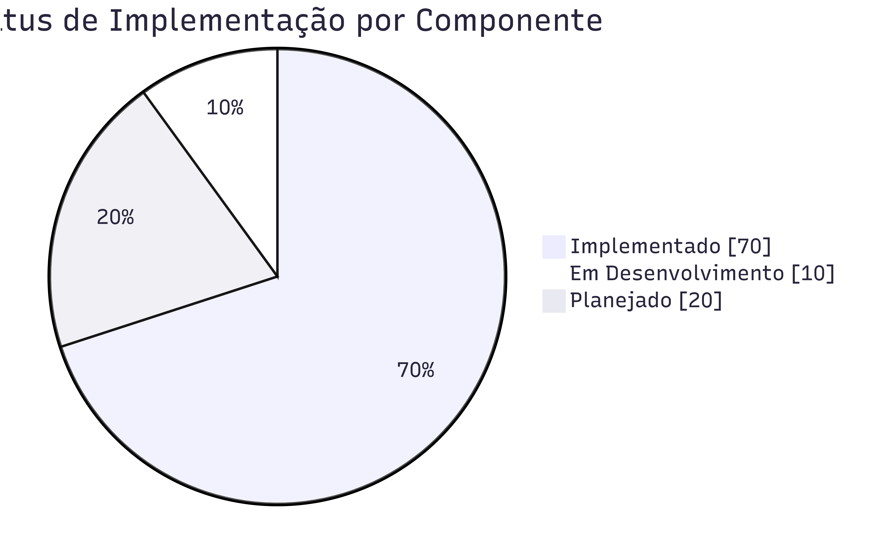
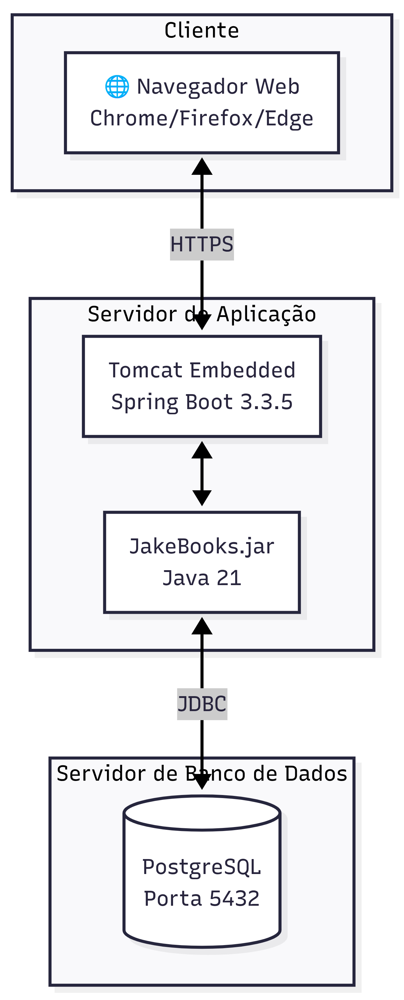
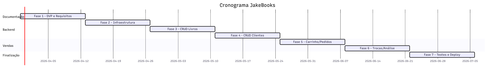

# Documento de Visão de Projeto - JakeBooks

---

## Histórico de Versões

| Data       | Versão | Descrição                      | Autor             | Revisor |
|------------|--------|--------------------------------|-------------------|---------|
| 29/03/2026 | 1.0    | Modelagem do DVP    | Breno Oliveira    | Rodrigo Rocha       |

---

## Informações do Documento

| Campo         | Valor                              |
|---------------|------------------------------------|
| **Cliente**   | FATEC Mogi - Interno                    |
| **Documento** | Documento de Visão de Projeto      |
| **Data**      | 29 de março de 2026                |
| **Autor**     | Breno Oliveira                     |

---

## Sumário

1. [Objetivo](#1-objetivo)
2. [Escopo](#2-escopo)
3. [Referências](#3-referências)
4. [Necessidades de Negócio](#4-necessidades-de-negócio)
5. [Objetivo do Projeto](#5-objetivo-do-projeto)
6. [Declaração Preliminar de Escopo](#6-declaração-preliminar-de-escopo)
7. [Premissas](#7-premissas)
8. [Influencia das Partes Interessadas](#8-Influencia-das-partes-interessadas)
9. [Representação Arquitetural](#9-representação-arquitetural)
10. [Visão de Use Case](#10-visão-de-use-case)
11. [Visão de Lógica](#11-visão-de-lógica)
12. [Visão de Implantação](#12-visão-de-implantação)
13. [Visão de Implementação](#13-visão-de-implementação)
14. [Visão de Dados](#14-visão-de-dados)
15. [Tamanho e Performance](#15-tamanho-e-performance)
16. [Qualidade](#16-qualidade)
17. [Cronograma Macro](#17-cronograma-macro)
18. [Referências](#18-referências)

---

## 1. Objetivo

Este documento tem como finalidade apresentar a visão geral do sistema **JakeBooks**, uma plataforma de e-commerce especializada na venda de livros, desenvolvida como trabalho acadêmico para a disciplina de Laboratório de Engenharia de Software (LES) da FATEC Mogi das Cruzes.

O documento destina-se a:
- **Equipe de desenvolvimento**: para alinhamento técnico e de requisitos
- **Orientadores e avaliadores**: para compreensão do escopo e objetivos do projeto
- **Stakeholders acadêmicos**: para validação das funcionalidades propostas

Este DVP visa alinhar as expectativas de todos os envolvidos, justificar as decisões de projeto, documentar as necessidades identificadas e apresentar uma visão consolidada do produto a ser desenvolvido.

---

## 2. Escopo

O **JakeBooks** é um sistema de comércio eletrônico voltado para a venda de livros, com foco em atender às necessidades de uma livraria virtual completa. O sistema contempla todo o ciclo de vida de uma operação de e-commerce, desde o cadastro de produtos até a entrega e eventual troca de mercadorias.

### Público-alvo
- **Clientes finais**: consumidores que desejam adquirir livros online
- **Administradores**: funcionários responsáveis pela gestão do catálogo, estoque e operações

### Módulos do Sistema



### O que está **dentro** do escopo
- Cadastro completo de livros com categorias, autores e editoras
- Gestão de clientes com múltiplos endereços e cartões
- Carrinho de compras com controle de expiração
- Processo de compra com múltiplas formas de pagamento
- Controle de estoque com entrada e baixa automática
- Sistema de trocas e geração de cupons
- Análise de vendas por período

### O que está **fora** do escopo
- Integração com gateways de pagamento reais
- Integração com transportadoras para cálculo de frete real
- Sistema de avaliações e comentários de livros
- Programa de fidelidade avançado
- Versão mobile nativa

---

## 3. Referências

### 3.1 Documentos de Entrada

| Documento                              | Descrição                                                    |
|----------------------------------------|--------------------------------------------------------------|
| AGENTS.md                              | Documentação dos agentes envolvidos no desenvolvimento         |
| Requisitos Funcionais (RF)             | Lista de requisitos funcionais do sistema                    |
| Requisitos Não Funcionais (RNF)        | Lista de requisitos não funcionais                           |
| Regras de Negócio (RN)                 | Documentação das regras de negócio                           |

### 3.2 Documentos Gerados

| Documento                              | Descrição                                                    |
|----------------------------------------|--------------------------------------------------------------|
| Documento de Requisitos                | Detalhamento completo dos requisitos                         |
| Modelo de Domínio                      | Diagrama de classes do domínio                               |
| Documento de Arquitetura               | Decisões arquiteturais e componentes                         |

### 3.3 Referências Técnicas

| Referência                             | URL/Descrição                                                |
|----------------------------------------|--------------------------------------------------------------|
| Spring Boot Documentation              | https://spring.io/projects/spring-boot                       |
| Spring Data JPA                        | https://spring.io/projects/spring-data-jpa                   |
| Thymeleaf                              | https://www.thymeleaf.org/                                   |
| Bootstrap 5                            | https://getbootstrap.com/                                    |
| PostgreSQL                             | https://www.postgresql.org/                                  |
| UML - Unified Modeling Language        | http://www.omg.org/technology/documents/formal/uml.htm       |

---

## 4. Necessidades de Negócio

O mercado de venda de livros enfrenta desafios significativos quando não dispõe de uma plataforma digital adequada. Este projeto surge para atender às seguintes necessidades identificadas:

### 4.1 Cenário Atual (Sem a Solução)

#### Gestão de Catálogo Ineficiente
Livrarias sem sistema informatizado enfrentam dificuldades para gerenciar seu catálogo de livros. O controle manual de títulos, autores, editoras e categorias está sujeito a erros, duplicidades e informações desatualizadas. A precificação baseada em margem de lucro exige cálculos manuais que consomem tempo e podem gerar inconsistências.

#### Descontrole de Estoque
Sem um sistema integrado, o controle de estoque é feito de forma manual ou em planilhas isoladas. Isso resulta em:
- Vendas de produtos indisponíveis
- Perda de vendas por desconhecimento da disponibilidade
- Dificuldade em identificar o momento correto de reposição
- Impossibilidade de rastrear o custo real dos produtos

#### Processo de Venda Fragmentado
A ausência de um sistema de e-commerce obriga o cliente a realizar compras presencialmente ou por telefone, limitando o alcance geográfico e o horário de funcionamento. Além disso:
- Não há carrinho de compras virtual
- Pagamentos múltiplos (cartões + cupons) são complexos de gerenciar
- Não existe histórico consolidado de transações

#### Gestão de Clientes Limitada
Sem cadastro informatizado, a livraria não conhece seu cliente, não consegue:
- Manter histórico de compras
- Oferecer múltiplos endereços de entrega
- Gerenciar diferentes formas de pagamento
- Aplicar políticas de ranking ou fidelização

#### Processo de Troca Manual
Trocas e devoluções sem sistema geram:
- Perda de rastreabilidade
- Dificuldade em gerar créditos para o cliente
- Retrabalho na reentrada de produtos no estoque

### 4.2 Oportunidades de Negócio

#### Expansão Digital
Uma plataforma de e-commerce permite que a livraria opere 24 horas por dia, 7 dias por semana, alcançando clientes em qualquer localidade geográfica atendida por serviço de entrega.

#### Eficiência Operacional
A automação de processos como controle de estoque, cálculo de preços com margem, e gestão de pedidos reduz erros operacionais e libera a equipe para atividades de maior valor agregado.

#### Conhecimento do Cliente
Um cadastro estruturado de clientes permite:
- Análise de comportamento de compra
- Segmentação para campanhas de marketing
- Políticas de fidelização baseadas em ranking

#### Gestão Financeira Integrada
O sistema de pagamentos múltiplos (cartões e cupons) integrado ao controle de estoque permite:
- Baixa automática no estoque após aprovação do pagamento
- Geração de cupons de troca vinculados ao cliente
- Rastreabilidade completa das transações

### 4.3 Justificativa do Investimento

O desenvolvimento do JakeBooks justifica-se pelos seguintes fatores:

| Necessidade                                    | Solução Proposta                              |
|------------------------------------------------|-----------------------------------------------|
| Controle descentralizado de catálogo           | Cadastro unificado de livros com categorização |
| Erros de precificação                          | Cálculo automático baseado em grupo de precificação |
| Vendas de itens indisponíveis                  | Validação de estoque em tempo real            |
| Limitação geográfica e horária                 | Plataforma web disponível 24/7                |
| Desconhecimento do perfil do cliente           | Cadastro completo com histórico de transações |
| Processo de troca complexo                     | Fluxo automatizado com geração de cupons      |
| Ausência de métricas                           | Módulo de análise de vendas por período       |

---

## 5. Objetivo do Projeto

O projeto JakeBooks tem como objetivo **desenvolver e entregar uma plataforma de e-commerce completa para venda de livros**, contemplando as seguintes capacidades:

### Capacidades Funcionais

- **Gerenciar catálogo de livros** com cadastro, alteração, ativação e inativação de títulos, incluindo associação com autores, editoras e categorias
- **Controlar precificação** com cálculo automático do valor de venda baseado em grupos de precificação e margem de lucro
- **Cadastrar e gerenciar clientes** com múltiplos endereços (entrega e cobrança) e múltiplos cartões de crédito
- **Processar vendas eletrônicas** através de carrinho de compras com controle de expiração e validação de estoque em tempo real
- **Suportar múltiplas formas de pagamento** incluindo cartões de crédito e cupons (promocionais e de troca)
- **Controlar estoque** com entrada manual, baixa automática após aprovação de pagamento e reentrada via troca
- **Gerenciar trocas** com fluxo completo desde a solicitação até a geração de cupom de crédito
- **Analisar vendas** por período com visualização gráfica comparando produtos ou categorias

### Benefícios Esperados

| Benefício                              | Descrição                                                    |
|----------------------------------------|--------------------------------------------------------------|
| Operação contínua                      | Disponibilidade 24 horas por dia, 7 dias por semana          |
| Redução de erros operacionais          | Automatização de cálculos de preço, validação de estoque e processamento de pagamentos |
| Rastreabilidade completa               | Log de todas as transações com data, hora, usuário e dados alterados |
| Gestão financeira integrada            | Controle unificado de pagamentos, cupons e movimentação de estoque |
| Tomada de decisão baseada em dados     | Análise de vendas por período com gráficos comparativos      |
| Fidelização de clientes                | Sistema de ranking e histórico de transações por cliente     |

---

## 6. Declaração Preliminar de Escopo

### 6.1 Descrição

O **JakeBooks** é uma aplicação web de comércio eletrônico desenvolvida para livrarias que desejam expandir suas operações para o ambiente digital. O sistema permite que **clientes** naveguem pelo catálogo de livros, adicionem itens ao carrinho, realizem compras utilizando cartões de crédito e/ou cupons, e solicitem trocas quando necessário.

Por outro lado, **administradores** podem gerenciar o catálogo completo de livros (incluindo autores, editoras e categorias), controlar o estoque com entradas e acompanhamento de custos, processar pedidos em suas diversas etapas (processamento, transporte, entrega), autorizar trocas e visualizar análises de vendas.

O sistema opera em contexto acadêmico, desenvolvido como trabalho da disciplina de Laboratório de Engenharia de Software (LES) da FATEC Mogi das Cruzes, porém seguindo práticas e padrões de mercado que o tornam aplicável a cenários reais de livrarias de pequeno e médio porte.

### 6.2 Produtos a Serem Entregues

Os entregáveis do projeto estão organizados por fase (cada fase = 1 semana), com estimativas de esforço utilizando a técnica PERT (Program Evaluation and Review Technique).

#### Legenda de Certeza
| Símbolo | Significado | Descrição |
|---------|-------------|-----------|
| :)      | Alta        | Atividade bem conhecida, baixo risco |
| :\|     | Média       | Alguma incerteza, risco moderado |
| :(      | Baixa       | Alta incerteza, requer atenção |

---

#### Fase 1 - Documentação e Planejamento (Semana 1-2)

| ID | Atividade | Otimista (h) | Realista (h) | Pessimista (h) | Certeza | Descrição |
|----|-----------|--------------|--------------|----------------|---------|-----------|
| 1  | Elaborar DVP | 4 | 8 | 16 | :) | Documento de Visão de Projeto |
| 2  | Definir requisitos funcionais | 2 | 4 | 8 | :) | Levantamento de RFs do sistema |
| 3  | Definir requisitos não funcionais | 1 | 2 | 4 | :) | Levantamento de RNFs |
| 4  | Documentar regras de negócio | 2 | 4 | 8 | :\| | Especificação das RNs |
| 5  | Criar modelo de domínio | 2 | 4 | 8 | :\| | Diagrama de classes UML |

**Entregáveis da Fase 1:**
- Documento de Visão de Projeto (DVP)
- Documento de Requisitos (RFs, RNFs, RNs)
- Modelo de Domínio

---

#### Fase 2 - Infraestrutura e Backend Base (Semana 3-4)

| ID | Atividade | Otimista (h) | Realista (h) | Pessimista (h) | Certeza | Descrição |
|----|-----------|--------------|--------------|----------------|---------|-----------|
| 6  | Montar ambiente de desenvolvimento | 2 | 4 | 8 | :\| | Java 21, PostgreSQL, Maven |
| 7  | Criar estrutura do projeto Spring Boot | 1 | 2 | 4 | :) | Setup inicial com dependências |
| 8  | Configurar Spring Security | 2 | 4 | 8 | :\| | Autenticação e autorização |
| 9  | Criar entidades JPA (domain) | 4 | 8 | 16 | :\| | 17 entidades do modelo |
| 10 | Criar repositories | 2 | 4 | 8 | :) | Interfaces JpaRepository |
| 11 | Criar scripts DDL iniciais | 2 | 4 | 8 | :\| | Dados de domínio (autor, editora, categoria) |

**Entregáveis da Fase 2:**
- Projeto Spring Boot configurado
- Entidades JPA mapeadas
- Banco de dados estruturado

---

#### Fase 3 - CRUD de Livros (Semana 5-6)

| ID | Atividade | Otimista (h) | Realista (h) | Pessimista (h) | Certeza | Descrição |
|----|-----------|--------------|--------------|----------------|---------|-----------|
| 12 | Desenvolver LivroService | 4 | 8 | 16 | :\| | RN0011-RN0017 |
| 13 | Desenvolver LivroController | 2 | 4 | 8 | :) | Rotas /livros/** |
| 14 | Criar templates de livros | 4 | 8 | 12 | :\| | lista, detalhe, form |
| 15 | Implementar filtros de busca | 2 | 4 | 8 | :\| | RF0015 |
| 16 | Desenvolver EstoqueService | 2 | 4 | 8 | :\| | RN0051-RN0062 |

**Entregáveis da Fase 3:**
- CRUD completo de Livros
- Gestão de Estoque (entrada)
- Cálculo de preço por margem

---

#### Fase 4 - CRUD de Clientes (Semana 7-8)

| ID | Atividade | Otimista (h) | Realista (h) | Pessimista (h) | Certeza | Descrição |
|----|-----------|--------------|--------------|----------------|---------|-----------|
| 17 | Desenvolver ClienteService | 4 | 8 | 16 | :\| | RN0021-RN0028 |
| 18 | Desenvolver ClienteController | 2 | 4 | 8 | :) | Rotas /clientes/** |
| 19 | Criar templates de clientes | 4 | 8 | 12 | :\| | cadastro, edição, detalhe |
| 20 | Implementar validadores | 4 | 8 | 16 | :( | CPF, senha, cartão |
| 21 | Gestão de endereços e cartões | 4 | 8 | 12 | :\| | RF0026, RF0027 |

**Entregáveis da Fase 4:**
- CRUD completo de Clientes
- Cadastro de múltiplos endereços
- Cadastro de múltiplos cartões

---

#### Fase 5 - Carrinho e Pedidos (Semana 9-10)

| ID | Atividade | Otimista (h) | Realista (h) | Pessimista (h) | Certeza | Descrição |
|----|-----------|--------------|--------------|----------------|---------|-----------|
| 22 | Desenvolver CarrinhoService | 4 | 8 | 16 | :( | RN0031-RN0032, RN0044-RN0045 |
| 23 | Desenvolver PedidoService | 6 | 12 | 24 | :( | RN0033-RN0043 |
| 24 | Implementar múltiplos pagamentos | 4 | 8 | 16 | :( | Cartões + Cupons |
| 25 | Criar templates de carrinho | 2 | 4 | 8 | :\| | view, checkout |
| 26 | Criar templates de pedidos | 2 | 4 | 8 | :\| | lista, detalhe |
| 27 | Implementar baixa de estoque | 2 | 4 | 8 | :\| | RF0053 |

**Entregáveis da Fase 5:**
- Carrinho de compras funcional
- Fluxo completo de pedido
- Múltiplas formas de pagamento

---

#### Fase 6 - Trocas e Análise (Semana 11-12)

| ID | Atividade | Otimista (h) | Realista (h) | Pessimista (h) | Certeza | Descrição |
|----|-----------|--------------|--------------|----------------|---------|-----------|
| 28 | Desenvolver TrocaService | 4 | 8 | 16 | :\| | RN0041-RN0043 |
| 29 | Implementar geração de cupom | 2 | 4 | 8 | :\| | RF0044 |
| 30 | Criar templates de trocas | 2 | 4 | 8 | :) | lista, detalhe, solicitar |
| 31 | Desenvolver AnaliseService | 4 | 8 | 16 | :( | RF0055 |
| 32 | Criar dashboard de análise | 4 | 8 | 16 | :( | Gráficos Chart.js |

**Entregáveis da Fase 6:**
- Fluxo completo de trocas
- Geração de cupons
- Dashboard de análise

---

#### Fase 7 - Finalização (Semana 13-14)

| ID | Atividade | Otimista (h) | Realista (h) | Pessimista (h) | Certeza | Descrição |
|----|-----------|--------------|--------------|----------------|---------|-----------|
| 33 | Implementar LogService | 2 | 4 | 8 | :) | RNF0012 - Auditoria |
| 34 | Testes integrados | 4 | 8 | 16 | :\| | Validação de fluxos |
| 35 | Correção de bugs | 4 | 8 | 20 | :( | Ajustes finais |
| 36 | Documentação de usuário | 2 | 4 | 8 | :) | Manual básico |
| 37 | Deploy em ambiente de demonstração | 2 | 4 | 8 | :\| | Preparação para apresentação |

**Entregáveis da Fase 7:**
- Sistema testado e validado
- Documentação de usuário
- Ambiente de demonstração

---

#### Resumo de Estimativas

| Fase | Semanas | Horas (Otimista) | Horas (Realista) | Horas (Pessimista) |
|------|---------|------------------|------------------|---------------------|
| Fase 1 - Documentação | 1-2 | 11 | 22 | 44 |
| Fase 2 - Infraestrutura | 3-4 | 13 | 26 | 52 |
| Fase 3 - CRUD Livros | 5-6 | 14 | 28 | 52 |
| Fase 4 - CRUD Clientes | 7-8 | 18 | 36 | 64 |
| Fase 5 - Carrinho/Pedidos | 9-10 | 20 | 40 | 80 |
| Fase 6 - Trocas/Análise | 11-12 | 16 | 32 | 64 |
| Fase 7 - Finalização | 13-14 | 14 | 28 | 60 |
| **TOTAL** | **14** | **106** | **212** | **416** |

> **Nota:** Estimativa PERT = (Otimista + 4×Realista + Pessimista) / 6 ≈ **220 horas**

### 6.3 Requisitos

#### 6.3.1 Requisitos Funcionais

Os requisitos funcionais estão organizados por módulo do sistema:

**Módulo de Livros**
| ID      | Requisito                                          |
|---------|----------------------------------------------------|
| RF0011  | Cadastrar livro com todos os atributos do modelo   |
| RF0012  | Inativar livro manualmente com justificativa       |
| RF0013  | Inativar livro automaticamente (categoria FORA DE MERCADO) |
| RF0014  | Alterar dados do livro                             |
| RF0015  | Consultar livros com filtros combinados            |
| RF0016  | Ativar livro com justificativa                     |

**Módulo de Clientes**
| ID      | Requisito                                          |
|---------|----------------------------------------------------|
| RF0021  | Cadastrar cliente com dados pessoais               |
| RF0022  | Alterar dados do cliente                           |
| RF0023  | Inativar cliente                                   |
| RF0024  | Consultar cliente                                  |
| RF0025  | Consultar transações do cliente                    |
| RF0026  | Cadastrar múltiplos endereços                      |
| RF0027  | Cadastrar múltiplos cartões (um preferencial)      |
| RF0028  | Alterar apenas senha                               |

**Módulo de Vendas**
| ID      | Requisito                                          |
|---------|----------------------------------------------------|
| RF0031  | Gerenciar carrinho de compras                      |
| RF0032  | Definir quantidade de itens no carrinho            |
| RF0033  | Realizar compra                                    |
| RF0034  | Calcular frete                                     |
| RF0035  | Selecionar endereço de entrega                     |
| RF0036  | Selecionar formas de pagamento (cartão, cupom promocional, cupom de troca) |
| RF0037  | Finalizar compra (status EM PROCESSAMENTO)         |
| RF0038  | Despachar produtos (status EM TRANSPORTE)          |
| RF0039  | Confirmar entrega (status ENTREGUE)                |
| RF0040  | Solicitar troca                                    |
| RF0041  | Autorizar troca                                    |
| RF0042  | Visualizar trocas (administrador)                  |
| RF0043  | Confirmar recebimento de troca                     |
| RF0044  | Gerar cupom de troca                               |

**Módulo de Estoque**
| ID      | Requisito                                          |
|---------|----------------------------------------------------|
| RF0051  | Registrar entrada em estoque                       |
| RF0052  | Calcular valor de venda baseado em margem          |
| RF0053  | Baixa automática após venda aprovada               |
| RF0054  | Reentrada de produtos via troca                    |

**Módulo de Análise**
| ID      | Requisito                                          |
|---------|----------------------------------------------------|
| RF0055  | Analisar histórico por período comparando produtos ou categorias |

#### 6.3.2 Requisitos Não Funcionais

**Desempenho**
| ID       | Requisito                                          |
|----------|----------------------------------------------------|
| RNF0011  | Tempo de resposta máximo de 1 segundo para qualquer operação |

**Rastreabilidade**
| ID       | Requisito                                          |
|----------|----------------------------------------------------|
| RNF0012  | Log de transações com data, hora, usuário e dados alterados |

**Segurança**
| ID       | Requisito                                          |
|----------|----------------------------------------------------|
| RNF0013  | Senha forte: mínimo 8 caracteres com maiúsculas, minúsculas e caracteres especiais |
| RNF0014  | Confirmação de senha no cadastro                   |
| RNF0015  | Armazenamento de senha criptografada               |

**Integridade de Dados**
| ID       | Requisito                                          |
|----------|----------------------------------------------------|
| RNF0016  | Código único obrigatório para livros               |
| RNF0017  | Código único de cliente                            |
| RNF0018  | Script inicial deve cadastrar domínios (autor, editora, categoria) |

**Usabilidade**
| ID       | Requisito                                          |
|----------|----------------------------------------------------|
| RNF0019  | Exibir itens removidos do carrinho por expiração   |
| RNF0020  | Exibição de análises em gráfico de linhas          |

**Stack Tecnológica (Obrigatória)**
| Componente       | Tecnologia                                         |
|------------------|----------------------------------------------------|
| Linguagem        | Java 21                                            |
| Framework        | Spring Boot 3                                      |
| Persistência     | Spring Data JPA + Hibernate                        |
| Banco de Dados   | PostgreSQL                                         |
| Template Engine  | Thymeleaf                                          |
| UI Framework     | Bootstrap 5                                        |
| Build Tool       | Maven                                              |

---

## 7. Premissas

As seguintes premissas foram consideradas verdadeiras no planejamento deste projeto:

### Premissas de Infraestrutura

| ID   | Premissa                                                                   |
|------|----------------------------------------------------------------------------|
| P001 | Ambiente de desenvolvimento disponível com Java 21 e PostgreSQL instalados |
| P002 | Acesso à internet para download de dependências Maven                       |
| P003 | Servidor para implantação do ambiente de demonstração disponível na Fase 2 |

### Premissas de Recursos Humanos

| ID   | Premissa                                                                   |
|------|----------------------------------------------------------------------------|
| P004 | Equipe de desenvolvimento com conhecimento em Java e Spring Boot           |
| P005 | Orientador (Profº Rodrigo Rocha) disponível para esclarecimento de dúvidas |
| P006 | Dedicação de tempo compatível com cronograma acadêmico                     |

### Premissas de Requisitos

| ID   | Premissa                                                                   |
|------|----------------------------------------------------------------------------|
| P007 | Modelo de domínio definido nos requisitos é a fonte única da verdade          |
| P008 | Requisitos funcionais e regras de negócio não sofrerão alterações significativas |
| P009 | Não há necessidade de integração com sistemas externos reais (pagamento, frete) |

### Premissas Acadêmicas

| ID   | Premissa                                                                   |
|------|----------------------------------------------------------------------------|
| P010 | O sistema será avaliado em ambiente controlado, não em produção real       |
| P011 | Volume de dados para testes será limitado e controlado                     |
| P012 | Não há requisito de alta disponibilidade ou escalabilidade horizontal      |

---

## 8. Influencia das Partes Interessadas

### Matriz de Stakeholders



### Detalhamento dos Stakeholders

| Stakeholder          | Interesse no Projeto                              | Influencia | Expectativas                                      |
|----------------------|---------------------------------------------------|------------|---------------------------------------------------|
| **Profº Rodrigo Rocha** (Orientador) | Sucesso acadêmico do projeto, aplicação correta de conceitos de engenharia de software | Alta | Documentação completa, código bem estruturado, cumprimento de prazos |
| **Equipe de Desenvolvimento** (Breno Oliveira) | Aprendizado técnico, aprovação na disciplina | Alta | Requisitos claros, suporte do orientador, escopo viável |
| **Avaliadores FATEC** | Conformidade com critérios de avaliação da disciplina | Alta | Atendimento aos requisitos funcionais, documentação adequada, demonstração funcional |
| **Usuários de Teste** | Validação do sistema em cenários reais | Baixa | Sistema funcional, interface intuitiva, fluxos completos |

### Análise de Influencia

#### Stakeholders com Influencia Positiva

| Stakeholder              | Contribuição Esperada                              |
|--------------------------|---------------------------------------------------|
| Orientador               | Direcionamento técnico, validação de decisões, feedback contínuo |
| Equipe de Desenvolvimento| Execução técnica, resolução de problemas, documentação |

#### Potenciais Riscos de Stakeholders

| Risco                                    | Stakeholder Relacionado | Mitigação                              |
|------------------------------------------|-------------------------|----------------------------------------|
| Indisponibilidade para esclarecimentos   | Orientador              | Agendar reuniões com antecedência      |
| Sobrecarga acadêmica                     | Equipe de Desenvolvimento | Planejamento realista de cronograma    |

---

## 9. Representação Arquitetural

O JakeBooks adota uma arquitetura em camadas baseada no padrão **MVC (Model-View-Controller)**, implementada através do framework Spring Boot. Esta arquitetura foi escolhida por atender aos requisitos de manutenibilidade, separação de responsabilidades e facilidade de testes.



### Componentes Arquiteturais

| Componente           | Tecnologia                | Responsabilidade                              |
|----------------------|---------------------------|-----------------------------------------------|
| **Controller**       | Spring MVC                | Receber requisições HTTP, chamar Services, retornar Views |
| **Service**          | Spring @Service           | Implementar regras de negócio, gerenciar transações |
| **Repository**       | Spring Data JPA           | Acesso a dados via interfaces JpaRepository   |
| **Entity**           | JPA/Hibernate             | Mapeamento objeto-relacional                  |
| **DTO**              | Java Records              | Transferência de dados entre camadas          |
| **Validator**        | Classes customizadas      | Validações de negócio (CPF, senha, cartão)    |
| **View**             | Thymeleaf + Bootstrap 5   | Renderização de páginas HTML                  |
| **Security**         | Spring Security           | Autenticação e autorização                    |

### 9.1 Restrições Arquiteturais

As seguintes restrições técnicas condicionam as escolhas arquiteturais do sistema:

| Restrição                          | Descrição                                              |
|------------------------------------|--------------------------------------------------------|
| **Linguagem**                      | Java 21 (LTS)                                          |
| **Framework**                      | Spring Boot 3.3.5                                      |
| **Persistência**                   | Spring Data JPA + Hibernate                            |
| **Banco de Dados**                 | PostgreSQL (produção)                                  |
| **Template Engine**                | Thymeleaf 3.x                                          |
| **UI Framework**                   | Bootstrap 5                                            |
| **Build Tool**                     | Maven                                                  |
| **Autenticação**                   | Spring Security com BCrypt (força 12)                  |
| **Controle de Versão**             | Git (GitHub)                                           |
### 9.2 Objetivos e Restrições Arquiteturais

| Objetivo de Qualidade      | Restrição/Decisão Arquitetural                          | RNF Relacionado |
|----------------------------|--------------------------------------------------------|-----------------|
| **Desempenho**             | Tempo de resposta < 1 segundo                          | RNF0011         |
| **Rastreabilidade**        | LogService via AOP para auditoria de transações        | RNF0012         |
| **Segurança**              | Senha criptografada com BCrypt, CSRF habilitado        | RNF0013-RNF0015 |
| **Manutenibilidade**       | Separação em camadas, sem lógica em Controllers        | -               |
| **Integridade**            | Transações gerenciadas por @Transactional              | -               |

---

## 10. Visão de Use Case

### 10.1 Diagrama de Caso de Uso

O sistema possui dois atores principais: **Cliente** (usuário autenticado) e **Administrador** (usuário com role ADMIN).




### 10.2 Descrição dos Casos de Uso Arquiteturalmente Significativos

Os casos de uso selecionados como arquiteturalmente significativos são aqueles que:
- Envolvem múltiplas entidades de domínio
- Possuem regras de negócio complexas
- Impactam diretamente a integridade dos dados

| Caso de Uso              | Descrição                                              | Componentes Envolvidos                    |
|--------------------------|--------------------------------------------------------|-------------------------------------------|
| **UC4: Finalizar Compra**| Envolve validação de estoque, múltiplos pagamentos, baixa de estoque, criação de pedido | CarrinhoService, PedidoService, EstoqueService, Pagamento |
| **UC6: Solicitar Troca** | Altera status de pedido, gera cupom de crédito, reentrada em estoque | TrocaService, CupomService, EstoqueService |
| **UC10: Gerenciar Livros**| Cálculo de preço por margem, validação de autorização para redução de preço | LivroService, EstoqueService, GrupoPrecificacao |
| **UC14: Analisar Vendas**| Agregação de dados por período com múltiplos filtros | AnaliseService, PedidoRepository, ItemPedidoRepository |

#### UC4: Finalizar Compra (Fluxo Principal)

> **Status de Implementação:** Este caso de uso possui a lógica de backend implementada (Services e Controllers), porém o fluxo completo de integração com gateway de pagamento é **simulado**. A baixa de estoque e geração de cupons estão funcionais no ambiente de testes.

**Componentes Envolvidos:**

| Componente | Arquivo | Status |
|------------|---------|--------|
| CarrinhoController | `controller/CarrinhoController.java` | ✅ Implementado |
| CarrinhoService | `services/CarrinhoService.java` | ✅ Implementado |
| PedidoService | `services/PedidoService.java` | ✅ Implementado |
| EstoqueRepository | `repository/EstoqueRepository.java` | ✅ Implementado |
| View Carrinho | `templates/carrinho/view.html` | ✅ Implementado |
| View Checkout | `templates/carrinho/checkout.html` | ✅ Implementado |
| Gateway de Pagamento | Integração externa | 🔄 Simulado |

**Regras de Negócio Aplicadas:**

| Regra | Descrição | Status |
|-------|-----------|--------|
| RN0031 | Validar estoque no carrinho | ✅ |
| RN0032 | Validar estoque antes da finalização | ✅ |
| RN0033 | Apenas um cupom promocional por compra | ✅ |
| RN0034 | Múltiplos cartões (mínimo R$10 por cartão) | ✅ |
| RN0035 | Consumir cupons antes do cartão | ✅ |
| RN0036 | Gerar cupom para excedente | ✅ |
| RN0063 | Máximo 10 unidades do mesmo livro | ✅ |
| RN0064 | Pedido mínimo R$20 sem frete | ✅ |
| RN0065 | 3 pagamentos REPROVADOS bloqueiam carrinho | ✅ |

**Diagrama de Sequência Detalhado:**


**Fluxo de Estados do Pedido:**



---

## 11. Visão de Lógica

> **Nota sobre o Status do Desenvolvimento:** O sistema JakeBooks encontra-se em desenvolvimento ativo. As seções abaixo indicam claramente o status de cada componente: ✅ Implementado, 🔄 Em Desenvolvimento, ⏳ Planejado.

A organização lógica do sistema segue a estrutura de pacotes definida pela arquitetura em camadas.

### 11.0 Visão Geral da Arquitetura




**Legenda de Status:**
| Símbolo | Significado | Descrição |
|---------|-------------|-----------|
| ✅ | Implementado | Componente codificado e funcional |
| 🔄 | Em Desenvolvimento | Parcialmente implementado ou em testes |
| ⏳ | Planejado | Previsto para fases futuras |

### 11.1 Camada de Apresentação

A camada de apresentação é composta por Controllers (Spring MVC) e Views (Thymeleaf + Bootstrap 5).

**Controllers (com.les.jakebooks.controller)**

| Controller           | Rotas Principais                           | Responsabilidade                        | Status |
|----------------------|--------------------------------------------|-----------------------------------------|--------|
| HomeController       | `/`                                        | Página inicial                          | ✅ |
| LivroController      | `/livros/**`                               | CRUD de livros, listagem, detalhes      | ✅ |
| ClienteController    | `/clientes/**`                             | Cadastro, edição, perfil de clientes    | ✅ |
| CarrinhoController   | `/carrinho/**`                             | Gerenciamento do carrinho, checkout     | ✅ |
| PedidoController     | `/pedidos/**`                              | Visualização e gestão de pedidos        | ✅ |
| EstoqueController    | `/estoque/**`                              | Entrada em estoque (ADMIN)              | ✅ |
| TrocaController      | `/trocas/**`                               | Solicitação e autorização de trocas     | ⏳ |
| AnaliseController    | `/analise/**`                              | Dashboard de análise (ADMIN)            | ⏳ |
| AuthController       | `/login`, `/logout`                        | Autenticação                            | ✅ |

**Views (src/main/resources/templates)**

| Diretório            | Templates                                  | Descrição                               | Status |
|----------------------|--------------------------------------------|-----------------------------------------|--------|
| `/fragments`         | layout, navbar, sidebar, footer, messages  | Componentes reutilizáveis               | ✅ |
| `/livros`            | lista, detalhe, form                       | Páginas de livros                       | ✅ |
| `/clientes`          | form-cadastro, form-edicao, detalhe, lista | Páginas de clientes                     | ✅ |
| `/carrinho`          | view, checkout                             | Carrinho e finalização                  | ✅ |
| `/pedidos`           | lista, detalhe                             | Visualização de pedidos                 | ✅ |
| `/estoque`           | lista, form-entrada                        | Gestão de estoque                       | ✅ |
| `/trocas`            | lista, detalhe, solicitar                  | Fluxo de trocas                         | ⏳ |
| `/analise`           | dashboard                                  | Gráficos e análises                     | ⏳ |
| `/error`             | 403, 404, 500                              | Páginas de erro                         | ✅ |

### 11.2 Camada de Negócio

> **Status:** A camada de negócio é a mais desenvolvida do sistema. Os Services principais (Livro, Cliente, Carrinho, Pedido, Estoque) estão **implementados e funcionais**. TrocaService e AnaliseService estão **planejados** para a Fase 6.

#### 11.2.1 Pacote Service

Os Services implementam toda a lógica de negócio, validações e regras do sistema.

| Service              | Regras de Negócio                                      | Status |
|----------------------|--------------------------------------------------------|--------|
| **LivroService**     | RN0011-RN0017 (cadastro, margem, inativação, ativação) | ✅ |
| **ClienteService**   | RN0021-RN0028 (endereços, cartões, ranking, senha)     | ✅ |
| **CarrinhoService**  | RN0031-RN0032, RN0044-RN0045, RN0063-RN0065 (validação, expiração, limites) | ✅ |
| **PedidoService**    | RN0033-RN0043, RN0064 (pagamento, status, frete)       | ✅ |
| **EstoqueService**   | RN0028, RN0051-RN0062 (entrada, baixa, custo)          | ✅ |
| **TrocaService**     | RN0041-RN0043 (autorização, status, cupom)             | ⏳ |
| **AnaliseService**   | RF0055 (agregação por período)                         | ⏳ |
| **LogService**       | RNF0012 (auditoria de transações)                      | ⏳ |

#### 11.2.2 Pacote Model (Domain)

Todas as entidades JPA estão **implementadas** conforme o modelo de domínio especificado no AGENTS.md.





### 11.3 Camada de Persistência

> **Status:** Todos os Repositories estão **implementados** e funcionais, incluindo queries customizadas com JPQL.

A camada de persistência utiliza Spring Data JPA com interfaces que estendem `JpaRepository`.

| Repository                 | Métodos Customizados                               | Status |
|----------------------------|----------------------------------------------------|--------|
| LivroRepository            | `findByIsbn()`, `findByCategoriasId()`, `buscarComFiltros()` | ✅ |
| ClienteRepository          | `findByEmail()`, `findByCpf()`, `findByCodigo()`   | ✅ |
| CarrinhoRepository         | `findByClienteIdAndStatusEquals()`                 | ✅ |
| PedidoRepository           | `findByClienteCodigoOrderByDataCriacaoDesc()`      | ✅ |
| EstoqueRepository          | `findByLivroId()`                                  | ✅ |
| CupomRepository            | `findByCodigoAndAtivoTrue()`                       | ✅ |
| TrocaRepository            | `findByPedidoId()`, `findByStatus()`               | ✅ |
| ItemCarrinhoRepository     | `findByCarrinhoIdAndLivroId()`                     | ✅ |
| PagamentoRepository        | `findByPedidoClienteIdAndStatusOrderByDataCriacaoDesc()` | ✅ |

**Estratégia de Mapeamento ORM**

| Relacionamento        | Estratégia JPA                                      | Exemplo no Código |
|-----------------------|-----------------------------------------------------|-------------------|
| OneToOne              | `@JoinColumn` com cascade                           | Pedido → Pagamento |
| OneToMany             | `mappedBy` com `orphanRemoval = true`               | Carrinho → ItemCarrinho |
| ManyToMany            | `@JoinTable` com tabela intermediária               | Livro ↔ Autor |
| ManyToOne             | `@JoinColumn` com `fetch = LAZY`                    | ItemPedido → Livro |
| Enums                 | `@Enumerated(EnumType.STRING)`                      | StatusPedido, StatusCarrinho |

### 11.4 Resumo do Status de Implementação

O quadro abaixo consolida o status atual de desenvolvimento do sistema JakeBooks por módulo funcional:





| Módulo | Funcionalidades | Backend | Frontend | Status Geral |
|--------|-----------------|---------|----------|--------------|
| **Livros** | Cadastro, Consulta, Ativação/Inativação, Filtros | ✅ | ✅ | ✅ Completo |
| **Clientes** | Cadastro, Edição, Endereços, Cartões, Senha | ✅ | ✅ | ✅ Completo |
| **Carrinho** | Criar, Adicionar, Remover, Expiração | ✅ | ✅ | ✅ Completo |
| **Pedidos** | Finalizar, Calcular Frete, Status | ✅ | ✅ | ✅ Completo |
| **Estoque** | Entrada, Baixa Automática, Custo | ✅ | ✅ | ✅ Completo |
| **Trocas** | Solicitar, Autorizar, Gerar Cupom | ⏳ | ⏳ | ⏳ Fase 6 |
| **Análise** | Dashboard, Gráficos por Período | ⏳ | ⏳ | ⏳ Fase 6 |
| **Auditoria** | Log de Transações (RNF0012) | ⏳ | N/A | ⏳ Fase 7 |

**Próximos Passos para Conclusão:**

1. **Fase 6 (Semanas 11-12):**
   - Implementar TrocaService com fluxo completo de troca
   - Implementar geração automática de cupom de troca
   - Criar AnaliseService com agregação por período
   - Desenvolver dashboard com gráficos Chart.js

2. **Fase 7 (Semanas 13-14):**
   - Implementar LogService para auditoria (RNF0012)
   - Testes integrados de todos os fluxos
   - Correção de bugs identificados

---

## 12. Visão de Implantação



### Requisitos de Implantação

| Componente           | Requisito Mínimo                                    |
|----------------------|-----------------------------------------------------|
| **JRE**              | Java 21 (OpenJDK ou Oracle)                         |
| **Memória**          | 512 MB RAM                                          |
| **PostgreSQL**       | Versão 14+                                          |
| **Porta Aplicação**  | 8080 (configurável)                                 |
| **Porta Banco**      | 5432 (padrão PostgreSQL)                            |

---

## 13. Visão de Implementação

> **Status:** A estrutura de pacotes está organizada e a maioria dos componentes principais está implementada. Os arquivos marcados com ⏳ estão planejados para fases futuras.

A estrutura de implementação espelha a visão lógica, organizada nos seguintes pacotes:

```
com.les.jakebooks/
├── JakebooksApplication.java          # ✅ Classe principal Spring Boot
├── config/
│   ├── SecurityConfig.java            # ✅ Configuração Spring Security
│   ├── WebMvcConfig.java              # ✅ Configuração MVC
│   └── CustomUserDetailsService.java  # ✅ Autenticação de usuários
├── controller/
│   ├── HomeController.java            # ✅
│   ├── LivroController.java           # ✅
│   ├── ClienteController.java         # ✅
│   ├── CarrinhoController.java        # ✅
│   ├── PedidoController.java          # ✅
│   ├── EstoqueController.java         # ✅
│   ├── TrocaController.java           # ⏳ Planejado Fase 6
│   ├── AnaliseController.java         # ⏳ Planejado Fase 6
│   └── AuthController.java            # ✅
├── services/
│   ├── LivroService.java              # ✅
│   ├── ClienteService.java            # ✅
│   ├── CarrinhoService.java           # ✅
│   ├── PedidoService.java             # ✅
│   ├── EstoqueService.java            # ✅
│   ├── TrocaService.java              # ⏳ Planejado Fase 6
│   ├── AnaliseService.java            # ⏳ Planejado Fase 6
│   └── LogService.java                # ⏳ Planejado Fase 7 (RNF0012)
├── domain/
│   ├── Livro.java                     # ✅
│   ├── Cliente.java                   # ✅
│   ├── Pedido.java                    # ✅
│   ├── Carrinho.java                  # ✅
│   ├── Estoque.java                   # ✅
│   ├── Troca.java                     # ✅
│   ├── Pagamento.java                 # ✅
│   └── (+ 10 entidades auxiliares)    # ✅
├── repository/
│   └── (todas interfaces JpaRepository) # ✅
├── dto/
│   └── (records para transferência)   # ✅
├── validator/
│   ├── SenhaValidator.java            # ✅
│   ├── CpfValidator.java              # ✅
│   ├── CartaoValidator.java           # ✅
│   └── PagamentoValidator.java        # ✅
├── exception/
│   ├── ValidacaoNegocioException.java # ✅
│   ├── RecursoNaoEncontradoException.java # ✅
│   └── PagamentoReprovadoException.java   # ✅
└── util/
    ├── CriptografiaUtil.java          # ✅
    └── SecurityUtil.java              # ✅
```

---

## 14. Visão de Dados

### Modelo Entidade-Relacionamento


### Mecanismo de Persistência

| Aspecto               | Implementação                                       |
|-----------------------|-----------------------------------------------------|
| **ORM**               | Hibernate 6.x (via Spring Data JPA)                 |
| **Transações**        | @Transactional em Services                          |
| **Pool de Conexões**  | HikariCP (padrão Spring Boot)                       |
| **DDL**               | `spring.jpa.hibernate.ddl-auto=update`              |
| **Dialeto**           | PostgreSQLDialect                                   |

---

## 15. Tamanho e Performance

### Estimativas de Volume

| Entidade             | Volume Estimado (Teste)  | Volume Estimado (Produção) |
|----------------------|--------------------------|----------------------------|
| Livros               | 100                      | 10.000+                    |
| Clientes             | 50                       | 5.000+                     |
| Pedidos/mês          | 20                       | 500+                       |
| Itens de estoque     | 100                      | 10.000+                    |

### Requisitos de Desempenho

| Requisito            | Meta                     | Estratégia                              |
|----------------------|--------------------------|-----------------------------------------|
| Tempo de resposta    | < 1 segundo (RNF0011)    | Índices em colunas de busca, paginação  |
| Usuários simultâneos | 10 (teste)               | Pool de conexões HikariCP               |
| Disponibilidade      | 99% (horário comercial)  | Ambiente acadêmico controlado           |

---

## 16. Qualidade

### Atributos de Qualidade Priorizados

| Atributo             | Prioridade | Justificativa                           | RNF Relacionado |
|----------------------|------------|-----------------------------------------|-----------------|
| **Segurança**        | Alta       | Dados pessoais e financeiros de clientes | RNF0013-RNF0015 |
| **Integridade**      | Alta       | Consistência entre estoque, pedidos e pagamentos | RNF0016-RNF0018 |
| **Rastreabilidade**  | Alta       | Auditoria de todas as transações        | RNF0012         |
| **Manutenibilidade** | Média      | Código acadêmico, separação de camadas  | -               |
| **Usabilidade**      | Média      | Interface intuitiva com Bootstrap       | RNF0019-RNF0020 |

### Mecanismos de Segurança Implementados

| Mecanismo            | Implementação                                       |
|----------------------|-----------------------------------------------------|
| Autenticação         | Spring Security + CustomUserDetailsService          |
| Criptografia         | BCryptPasswordEncoder (força 12)                    |
| Autorização          | @PreAuthorize, hasRole('ADMIN')                     |
| CSRF                 | Token automático em formulários Thymeleaf           |
| Sessão               | HttpSession gerenciada pelo Spring                  |

---

## 17. Cronograma Macro

O cronograma está organizado em 7 fases, cada fase correspondendo a aproximadamente 1-2 semanas de trabalho.




| Fase | Semanas | Marco | Entregáveis Principais |
|------|---------|-------|------------------------|
| **Fase 1** | 1-2 | Documentação Completa | DVP, Requisitos, Modelo de Domínio |
| **Fase 2** | 3-4 | Infraestrutura Pronta | Projeto Spring Boot, Entidades JPA, BD |
| **Fase 3** | 5-6 | CRUD Livros | Gestão de Livros, Estoque, Precificação |
| **Fase 4** | 7-8 | CRUD Clientes | Gestão de Clientes, Endereços, Cartões |
| **Fase 5** | 9-10 | Vendas Funcionais | Carrinho, Pedidos, Pagamentos |
| **Fase 6** | 11-12 | Sistema Completo | Trocas, Cupons, Dashboard de Análise |
| **Fase 7** | 13-14 | Entrega Final | Sistema Testado, Documentação, Deploy |

### Marcos de Validação

| Semana | Marco | Critério de Aceite |
|--------|-------|---------------------|
| 2 | **M1** - Documentação | DVP aprovado pelo orientador |
| 4 | **M2** - Infraestrutura | Aplicação rodando com BD conectado |
| 6 | **M3** - Livros | CRUD de livros funcionando com estoque |
| 8 | **M4** - Clientes | CRUD de clientes com autenticação |
| 10 | **M5** - Vendas | Fluxo completo de compra funcionando |
| 12 | **M6** - Sistema | Trocas e análise implementados |
| 14 | **M7** - Entrega | Sistema completo em ambiente de demonstração |

> **Observação:** Os prazos são estimativas iniciais baseadas em ~15h/semana de dedicação. Ajustes podem ser necessários conforme o andamento do projeto.

---

## 18. Referências

- **Spring Boot Documentation**: https://spring.io/projects/spring-boot
- **Spring Data JPA**: https://spring.io/projects/spring-data-jpa
- **Spring Security**: https://spring.io/projects/spring-security
- **Thymeleaf**: https://www.thymeleaf.org/
- **Bootstrap 5**: https://getbootstrap.com/
- **PostgreSQL Documentation**: https://www.postgresql.org/docs/
- **Hibernate ORM**: https://hibernate.org/orm/documentation/
- **Unified Modeling Language (UML)**: http://www.omg.org/technology/documents/formal/uml.htm
- **Mermaid Diagrams**: https://mermaid.js.org/
- **RUP — Rational Unified Process**: Metodologia de desenvolvimento de software
