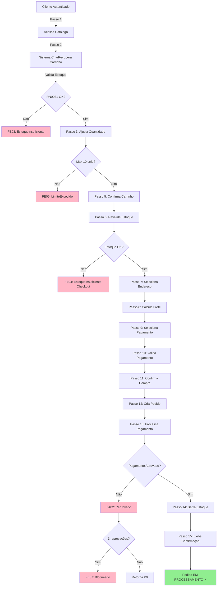
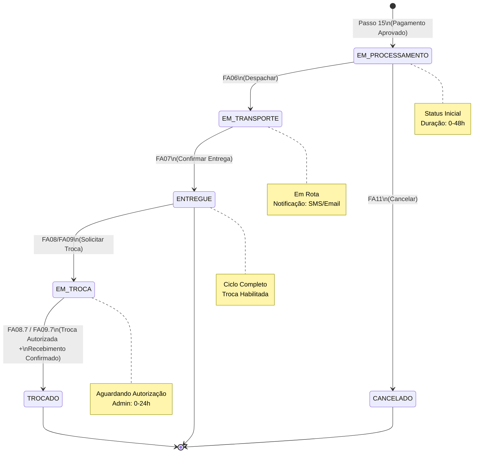
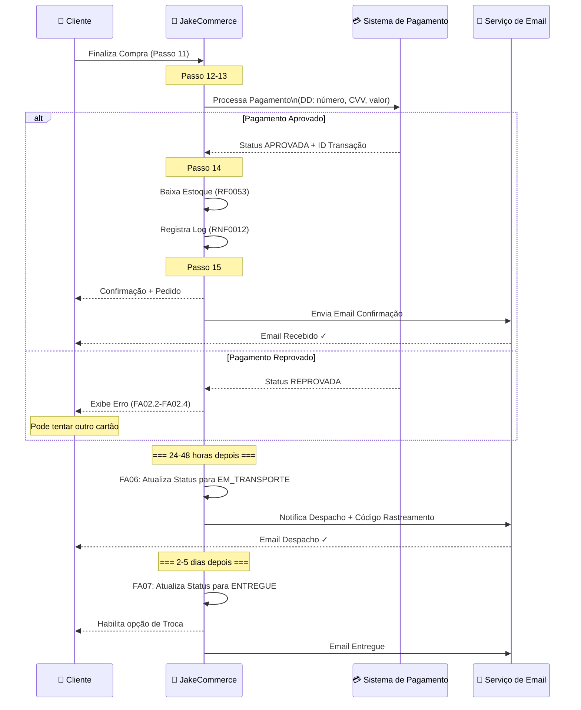

# UseCase - Jakebooks

# Histórico de Versão

| Data | Versão | Descrição | Autor | Revisor |
| --- | --- | --- | --- | --- |
| 13/04/2026 | 1.0.0 | Versão inicial | Breno Oliveira | Profº Rodrigo |
|  |  |  |  |  |

---

# Indíce

---

# Especificação de Caso de Uso

## Nome do Caso de Uso

**CDU01 – Caso de Uso de Condução de Vendas**

---

## Objetivo

Permitir que o cliente realize a compra de livros por meio do ambiente eletrônico da plataforma JakeCommerce, abrangendo desde a montagem do carrinho de compras até a finalização do pedido, o acompanhamento do status de entrega e os processos alternativos de troca total/parcial, cancelamento e devolução, suportando múltiplos meios de pagamento e garantindo a consistência entre estoque, pedido e pagamento em conformidade com as regras de negócio definidas.

---

## Descrição

O processo de venda no JakeCommerce inicia-se quando o cliente, devidamente autenticado, navega pelo catálogo de livros e adiciona títulos ao seu carrinho de compras. O carrinho possui tempo de expiração e reserva temporária de estoque, de modo que o cliente é avisado com antecedência caso a sessão esteja prestes a expirar. Durante esse período, o cliente pode ajustar quantidades, remover itens e verificar a disponibilidade em tempo real.

Ao prosseguir para o fechamento do pedido, o cliente seleciona o endereço de entrega cadastrado, escolhe a modalidade de frete e define a forma de pagamento, podendo combinar cupons promocionais, cupons de troca e múltiplos cartões de crédito. O sistema valida o estoque novamente antes de confirmar, processa o pagamento e, em caso de aprovação, registra o pedido com status **EM PROCESSAMENTO**, baixa o estoque e notifica o cliente.

Após a geração do pedido, o fluxo avança pelos estados de **EM TRANSPORTE** e **ENTREGUE**. Uma vez entregue, o cliente pode solicitar troca total ou parcial dos itens, respeitando as regras de autorização e geração de cupom de troca. Todo o ciclo é rastreado via log de transações, garantindo auditoria completa de cada operação de escrita realizada no sistema.

---

## Requisitos Funcionais

| Identificador | Descrição |
| --- | --- |
| RF0031 | Gerenciar carrinho |
| RF0032 | Definir quantidade no carrinho |
| RF0033 | Realizar compra |
| RF0034 | Calcular frete |
| RF0035 | Selecionar endereço |
| RF0036 | Selecionar pagamento (cartão, cupom promocional, cupom de troca) |
| RF0037 | Finalizar compra (status inicial: EM PROCESSAMENTO) |
| RF0038 | Despachar produtos (EM TRANSPORTE) |
| RF0039 | Confirmar entrega (ENTREGUE) |
| RF0040 | Solicitar troca |
| RF0041 | Autorizar troca |
| RF0042 | Visualizar trocas (admin) |
| RF0043 | Confirmar recebimento de troca |
| RF0044 | Gerar cupom de troca |
| RF0051 | Entrada em estoque |
| RF0052 | Calcular valor de venda |
| RF0053 | Baixa automática após venda |
| RF0054 | Reentrada via troca |

---

## Tipo de Caso de Uso

Concreto: descreve um fluxo de interação direta entre atores e o sistema, com fluxos alternativos e de exceção claramente identificados.

---

## Atores

| Ator | Tipo | Descrição |
| --- | --- | --- |
| Cliente | Primário | Usuário autenticado que realiza a compra, acompanha o pedido e solicita trocas. |
| Administrador | Primário | Usuário interno responsável por despachar produtos, confirmar entregas, autorizar trocas e visualizar trocas pendentes. |
| Sistema de Pagamento | Secundário (externo) | Serviço externo que processa e aprova ou reprova pagamentos com cartão. |
| Sistema de Estoque | Secundário (interno) | Componente interno responsável pela reserva, baixa e reentrada de itens em estoque. |

---

## Pré-condições

1. O cliente deve estar autenticado no sistema.
2. O cliente deve possuir pelo menos um endereço de entrega e um endereço de cobrança cadastrados (RN0021, RN0022).
3. O cliente deve possuir pelo menos um cartão cadastrado ou cupom válido para finalizar o pagamento.
4. Os livros desejados devem estar com status **ATIVO** e possuir estoque disponível maior que zero (RN0061).
5. O carrinho do cliente deve estar com status **ABERTO** (não expirado e sem bloqueio ativo).
6. O sistema de pagamento deve estar disponível.

---

## Fluxo Principal — Registrar Pedido de Venda

| Passo | Ator | Ação |
| --- | --- | --- |
| 1 | Cliente | Acessa o catálogo e seleciona livros para adicionar ao carrinho. |
| 2 | Sistema | Valida disponibilidade de estoque para cada item (RN0031). Cria ou recupera o carrinho ativo do cliente. |
| 3 | Cliente | Ajusta as quantidades dos itens (máximo 10 unidades do mesmo livro — RN0063). |
| 4 | Sistema | Atualiza `ItemCarrinho.quantidade` e `valorUnitario`. Exibe total parcial. |
| 5 | Cliente | Confirma o carrinho e avança para finalização da compra. |
| 6 | Sistema | Revalida estoque de todos os itens do carrinho (RN0032). |
| 7 | Cliente | Seleciona o endereço de entrega cadastrado (RF0035). |
| 8 | Sistema | Calcula o frete com base no endereço selecionado (RF0034). Aplica isenção de frete se o valor do pedido for igual ou superior a R$ 20,00 (RN0064). |
| 9 | Cliente | Seleciona os meios de pagamento (RF0036): cupom promocional e/ou cupons de troca e/ou cartões de crédito. |
| 10 | Sistema | Valida regras de pagamento: apenas um cupom promocional (RN0033); consome cupons antes dos cartões (RN0035); mínimo de R$ 10,00 por cartão (RN0034). |
| 11 | Cliente | Confirma e finaliza a compra. |
| 12 | Sistema | Cria o `Pedido` com status **EM PROCESSAMENTO**. Registra `ItemPedido`, `Pagamento`, `PagamentoCartao` e/ou `PagamentoCupom`. Envia a solicitação ao Sistema de Pagamento. |
| 13 | Sistema de Pagamento | Processa o pagamento e retorna status **APROVADA**. |
| 14 | Sistema | Atualiza `Pagamento.status` para **APROVADA**. Realiza a baixa automática no estoque (RN0028, RF0053). Registra log da transação (RNF0012). |
| 15 | Sistema | Exibe confirmação do pedido ao cliente com número, resumo e status. |

---

## Fluxos Alternativos

---

### FA01 — Carrinho Expirado ou Prestes a Expirar

**Origem:** Passo 2 ou qualquer passo durante a navegação.

| Passo | Ator | Ação |
| --- | --- | --- |
| FA01.1 | Sistema | Detecta que o tempo de expiração do carrinho está a 5 minutos do limite (RN0044). Exibe aviso ao cliente. |
| FA01.2 | Cliente | Pode confirmar continuidade da sessão ou ignorar o aviso. |
| FA01.3 | Sistema | Se o tempo expirar sem ação, bloqueia o carrinho, remove os itens não convertidos em pedido e exibe a lista de itens removidos por expiração (RNF — Vendas). Retorna o estoque reservado. |
| FA01.4 | Sistema | Se houver itens desbloqueados por terceiros durante a sessão, remove-os do carrinho e notifica o cliente (RN0045). |

---

### FA02 — Pagamento Reprovado

**Origem:** Passo 13 do fluxo principal

| Passo | Ator | Ação |
| --- | --- | --- |
| FA02.1 | Sistema de Pagamento | Retorna status **REPROVADA** para o pagamento. |
| FA02.2 | Sistema | Atualiza `Pagamento.status` para **REPROVADA**. Não realiza baixa de estoque. Registra log. |
| FA02.3 | Sistema | Incrementa contador de pagamentos reprovados consecutivos do cliente. |
| FA02.4 | Cliente | Pode tentar novamente com outro meio de pagamento. |
| FA02.5 | Sistema | Se o cliente acumular 3 pagamentos reprovados consecutivos, bloqueia o carrinho (RN0065) e exibe mensagem informativa. Retorna ao início. |

---

### FA03 — Pagar com Múltiplos Cartões

**Origem:** Passo 9 do fluxo principal

| Passo | Ator | Ação |
| --- | --- | --- |
| FA03.1 | Cliente | Opta por dividir o pagamento entre dois ou mais cartões cadastrados. |
| FA03.2 | Sistema | Valida que cada cartão receba ao menos R$ 10,00 (RN0034). |
| FA03.3 | Cliente | Define o valor a ser debitado em cada cartão. |
| FA03.4 | Sistema | Registra um `PagamentoCartao` por cartão utilizado. Submete cada cobrança ao Sistema de Pagamento. |
| FA03.5 | Sistema de Pagamento | Aprova ou reprova cada cobrança individualmente. |
| FA03.6 | Sistema | Somente conclui o pedido se todos os cartões forem aprovados. Caso contrário, executa FA02. |

---

### FA04 — Pagar com Cupom Promocional

**Origem:** Passo 9 do fluxo principal

| Passo | Ator | Ação |
| --- | --- | --- |
| FA04.1 | Cliente | Informa o código do cupom promocional. |
| FA04.2 | Sistema | Valida se o cupom está ativo, é do tipo **PROMOCIONAL** e ainda não foi aplicado nesta compra (RN0033). |
| FA04.3 | Sistema | Aplica o desconto do cupom ao total do pedido. Se o valor do cupom exceder o total, gera um novo cupom com o valor excedente (RN0036). |
| FA04.4 | Sistema | Registra `PagamentoCupom` com referência ao `Cupom`. Consome o cupom antes dos cartões (RN0035). |
| FA04.5 | Sistema | Se houver saldo restante, aplica a diferença nos cartões informados. |

---

### FA05 — Pagar com Cupom de Troca

**Origem:** Passo 9 do fluxo principal

| Passo | Ator | Ação |
| --- | --- | --- |
| FA05.1 | Cliente | Seleciona um ou mais cupons de troca disponíveis em sua conta. |
| FA05.2 | Sistema | Valida se cada cupom está ativo e é do tipo **TROCA**. |
| FA05.3 | Sistema | Aplica o valor dos cupons ao total. Consome cupons antes dos cartões (RN0035). Gera cupom com excedente se necessário (RN0036). |
| FA05.4 | Sistema | Registra `PagamentoCupom` para cada cupom utilizado. |

---

### FA06 — Despachar Produtos (Administrador)

**Origem:** Após Passo 15 do fluxo principal, quando o pedido está **EM PROCESSAMENTO**.

| Passo | Ator | Ação |
| --- | --- | --- |
| FA06.1 | Administrador | Acessa a lista de pedidos em processamento e seleciona um pedido para despacho. |
| FA06.2 | Sistema | Atualiza `Pedido.status` para **EM TRANSPORTE** (RN0039). Registra log da operação. |
| FA06.3 | Sistema | Notifica o cliente sobre o despacho. |

---

### FA07 — Confirmar Entrega

**Origem:** Após FA06, quando o pedido está **EM TRANSPORTE**.

| Passo | Ator | Ação |
| --- | --- | --- |
| FA07.1 | Administrador | Confirma a entrega do pedido ao cliente. |
| FA07.2 | Sistema | Atualiza `Pedido.status` para **ENTREGUE** (RN0040). Registra log. |
| FA07.3 | Sistema | Habilita a opção de solicitação de troca para o cliente. |

---

### FA08 — Solicitar Troca Total

**Origem:** Após FA07, com pedido **ENTREGUE**.

| Passo | Ator | Ação |
| --- | --- | --- |
| FA08.1 | Cliente | Acessa o pedido entregue e solicita troca de todos os itens, informando o motivo. |
| FA08.2 | Sistema | Valida que o pedido está com status **ENTREGUE** (RN0043). |
| FA08.3 | Sistema | Cria registro de `Troca` com `status` inicial e `motivo` informado. Atualiza `Pedido.status` para **EM TROCA** (RN0041). Registra log. |
| FA08.4 | Administrador | Visualiza as trocas pendentes (RF0042) e autoriza a troca (RF0041). |
| FA08.5 | Sistema | Atualiza `Troca.status` para **AUTORIZADA**. |
| FA08.6 | Administrador | Confirma o recebimento físico dos livros devolvidos (RF0043). |
| FA08.7 | Sistema | Realiza reentrada dos itens no estoque (RF0054). Gera cupom de troca no valor total dos itens devolvidos (RF0044). Atualiza `Pedido.status` para **TROCADO** (RN0042). Registra log. |

---

### FA09 — Solicitar Troca Parcial

**Origem:** Após FA07, com pedido **ENTREGUE**.

| Passo | Ator | Ação |
| --- | --- | --- |
| FA09.1 | Cliente | Acessa o pedido entregue e solicita troca de parte dos itens, informando quais livros e o motivo. |
| FA09.2 | Sistema | Valida que o pedido está com status **ENTREGUE** (RN0043). |
| FA09.3 | Sistema | Cria registro de `Troca` referenciando apenas os itens selecionados e o `motivo`. Atualiza `Pedido.status` para **EM TROCA** (RN0041). Registra log. |
| FA09.4 | Administrador | Visualiza e autoriza a troca parcial (RF0041, RF0042). |
| FA09.5 | Sistema | Atualiza `Troca.status` para **AUTORIZADA**. |
| FA09.6 | Administrador | Confirma o recebimento dos livros trocados (RF0043). |
| FA09.7 | Sistema | Realiza reentrada somente dos itens devolvidos no estoque (RF0054). Gera cupom de troca proporcional ao valor dos itens devolvidos (RF0044). Atualiza `Pedido.status` para **TROCADO** (RN0042). Registra log. |

---

### FA10 — Estoque Insuficiente ao Validar Carrinho

**Origem:** Passo 2 ou Passo 6.

| Passo | Ator | Ação |
| --- | --- | --- |
| FA10.1 | Sistema | Detecta que um ou mais itens do carrinho não possuem estoque suficiente. |
| FA10.2 | Sistema | Exibe mensagem indicando quais itens estão indisponíveis ou com quantidade insuficiente. |
| FA10.3 | Cliente | Remove os itens indisponíveis ou reduz as quantidades para prosseguir. |
| FA10.4 | Sistema | Se nenhum item válido restar no carrinho, encerra o fluxo sem gerar pedido. |

---

### FA11 — Cancelar Pedido

**Origem:** Após Passo 15, enquanto o pedido ainda está **EM PROCESSAMENTO**.

> **Nota:** O modelo de domínio não define explicitamente um status de CANCELADO. Este fluxo representa a recusa ou reversão antes do despacho.
> 

| Passo | Ator | Ação |
| --- | --- | --- |
| FA11.1 | Administrador | Identifica a necessidade de cancelar o pedido antes do despacho. |
| FA11.2 | Sistema | Reverte a baixa de estoque dos itens do pedido (reentrada). |
| FA11.3 | Sistema | Estorna os pagamentos realizados conforme a política da plataforma. Se foram utilizados cupons, reativa-os. |
| FA11.4 | Sistema | Registra log da operação. |

---

## Fluxos de Exceção

### FE01 — Cliente Bloqueado ou Inativo

**Origem:** Passo 1 (Fluxo Principal) — tentativa de acesso ao carrinho ou catálogo.
**Exceção associada:** `ClienteBloqueadoException`

| Passo | Ator | Ação |
| --- | --- | --- |
| FE01.1 | Sistema | Ao autenticar ou ao iniciar qualquer operação de compra, verifica o `StatusCliente` do cliente autenticado. |
| FE01.2 | Sistema | Detecta que o cliente está com status diferente de **ATIVO** (bloqueado ou inativo). |
| FE01.3 | Sistema | Lança `ClienteBloqueadoException`. Exibe mensagem informativa ao cliente indicando que sua conta está bloqueada e que deve entrar em contato com o suporte. |
| FE01.4 | Sistema | Impede o prosseguimento de qualquer operação de compra, gerenciamento de carrinho ou checkout. Registra a tentativa no log de transações (RNF0012). |

---

### FE02 — Livro Inativo ou Não Encontrado

**Origem:** Passo 1 ou Passo 2 (Fluxo Principal) — ao adicionar livro ao carrinho.
**Exceções associadas:** `LivroInativoException`, `LivroNaoEncontradoException`

| Passo | Ator | Ação |
| --- | --- | --- |
| FE02.1 | Sistema | Ao receber a solicitação de adição de um livro ao carrinho, consulta o `LivroRepository` pelo código informado. |
| FE02.2a | Sistema | Se o livro não for encontrado, lança `LivroNaoEncontradoException`. Exibe mensagem "Livro não encontrado." ao cliente. O carrinho permanece inalterado. |
| FE02.2b | Sistema | Se o livro for encontrado mas seu `StatusLivro` for diferente de **ATIVO**, lança `LivroInativoException`. Exibe mensagem "Este livro não está disponível para venda." ao cliente. O carrinho permanece inalterado. |
| FE02.3 | Sistema | Retorna o cliente à tela do catálogo para que selecione outro título. |

---

### FE03 — Estoque Insuficiente ao Adicionar Item

**Origem:** Passo 2 (Fluxo Principal) ou FA10 — ao adicionar ou ajustar quantidade no carrinho.
**Exceção associada:** `EstoqueInsuficienteException`

| Passo | Ator | Ação |
| --- | --- | --- |
| FE03.1 | Sistema | Ao tentar adicionar ou aumentar a quantidade de um livro no carrinho, consulta `EstoqueRepository` e verifica que a quantidade disponível é menor que a solicitada (RN0031, RN0061). |
| FE03.2 | Sistema | Lança `EstoqueInsuficienteException`. Exibe mensagem informando a quantidade disponível em estoque para aquele título. |
| FE03.3 | Sistema | Não atualiza o `ItemCarrinho`. O carrinho permanece no estado anterior à tentativa. |
| FE03.4 | Cliente | Pode ajustar a quantidade para um valor dentro do estoque disponível ou optar por não adicionar o item. |

---

### FE04 — Estoque Insuficiente na Revalidação antes da Finalização

**Origem:** Passo 6 (Fluxo Principal) — revalidação de estoque na confirmação do pedido.
**Exceção associada:** `EstoqueInsuficienteException`, `EstoqueInsuficienteParaBaixaException`

| Passo | Ator | Ação |
| --- | --- | --- |
| FE04.1 | Sistema | Ao revalidar o estoque antes da finalização (RN0032), detecta que um ou mais itens do carrinho têm quantidade superior ao estoque atual (situação pode ocorrer se outro cliente comprou o mesmo item no intervalo de tempo). |
| FE04.2 | Sistema | Lança `EstoqueInsuficienteException`. Exibe lista dos itens afetados com as quantidades disponíveis atuais. |
| FE04.3 | Sistema | Bloqueia a finalização do pedido. O carrinho é mantido, mas os itens afetados são sinalizados para revisão. |
| FE04.4 | Cliente | Deve ajustar as quantidades dos itens sinalizados ou removê-los para prosseguir com o checkout. |
| FE04.5 | Sistema | Após ajuste pelo cliente, reexecuta a validação (Passo 6). Se aprovada, retoma o fluxo principal no Passo 7. |

---

### FE05 — Limite de Itens por Pedido Excedido

**Origem:** Passo 3 (Fluxo Principal) — ao definir quantidade de um livro no carrinho.
**Exceções associadas:** `LimiteItensExcedidoException`, `LimitePedidoException`

| Passo | Ator | Ação |
| --- | --- | --- |
| FE05.1 | Cliente | Tenta definir uma quantidade superior a 10 unidades para o mesmo livro no carrinho (RN0063). |
| FE05.2 | Sistema | Detecta que `ItemCarrinho.quantidade` ultrapassaria o limite de 10 unidades para aquele título. Lança `LimiteItensExcedidoException`. |
| FE05.3 | Sistema | Exibe mensagem "Quantidade máxima permitida por livro é de 10 unidades por pedido." Mantém a quantidade anterior do item. |
| FE05.4 | Cliente | Pode ajustar a quantidade para um valor dentro do limite permitido. |

---

### FE06 — Carrinho Não Encontrado ou Vazio

**Origem:** Passo 5 (Fluxo Principal) — ao tentar avançar para o checkout com carrinho vazio.
**Exceções associadas:** `CarrinhoNaoEncontradoException`, `CarrinhoVazioException`

| Passo | Ator | Ação |
| --- | --- | --- |
| FE06.1 | Cliente | Tenta confirmar o carrinho e avançar para o checkout. |
| FE06.2a | Sistema | Se nenhum carrinho ativo for encontrado para o cliente, lança `CarrinhoNaoEncontradoException`. Exibe mensagem "Nenhum carrinho ativo encontrado." |
| FE06.2b | Sistema | Se o carrinho for encontrado mas não possuir nenhum `ItemCarrinho`, lança `CarrinhoVazioException`. Exibe mensagem "Seu carrinho está vazio. Adicione livros para continuar." |
| FE06.3 | Sistema | Impede o avanço para o checkout. Redireciona o cliente ao catálogo. |

---

### FE07 — Carrinho Bloqueado por Pagamentos Reprovados

**Origem:** FA02.5 (Fluxo Alternativo) — após 3 reprovações consecutivas de pagamento.
**Exceção associada:** `CarrinhoBloqueadoPagamentoException`

| Passo | Ator | Ação |
| --- | --- | --- |
| FE07.1 | Sistema | Ao processar mais uma tentativa de pagamento, detecta que o cliente já acumulou 3 reprovações consecutivas (RN0065). |
| FE07.2 | Sistema | Lança `CarrinhoBloqueadoPagamentoException`. Atualiza o `StatusCarrinho` para **BLOQUEADO**. |
| FE07.3 | Sistema | Exibe mensagem explicando o bloqueio e orienta o cliente a entrar em contato com o suporte para desbloqueio. |
| FE07.4 | Sistema | Registra o evento de bloqueio no log de transações (RNF0012). Impede qualquer nova tentativa de pagamento para o carrinho bloqueado. |
| FE07.5 | Sistema | O estoque reservado pelos itens do carrinho é liberado após o bloqueio. |

---

### FE08 — Carrinho Expirado Durante o Checkout

**Origem:** Qualquer passo do Fluxo Principal a partir do Passo 5, ou durante FA03–FA05.
**Exceção associada:** `CarrinhoExpiradoException`

| Passo | Ator | Ação |
| --- | --- | --- |
| FE08.1 | Sistema | Ao processar uma ação de checkout (seleção de endereço, pagamento ou finalização), detecta que `Carrinho.dataExpiracao` já foi ultrapassada e o carrinho está com `StatusCarrinho` **EXPIRADO**. |
| FE08.2 | Sistema | Lança `CarrinhoExpiradoException`. Exibe mensagem "Seu carrinho expirou. Os itens foram removidos." |
| FE08.3 | Sistema | Exibe a lista de itens que estavam no carrinho no momento da expiração (RNF — Vendas). Libera o estoque reservado por esses itens. |
| FE08.4 | Sistema | Cria automaticamente um novo carrinho vazio para o cliente com novo `dataCriacao` e `dataExpiracao`. |
| FE08.5 | Cliente | Pode reiniciar o processo de compra adicionando os itens novamente ao novo carrinho. |

---

### FE09 — Endereço de Entrega Não Cadastrado

**Origem:** Passo 7 (Fluxo Principal) — ao tentar selecionar endereço de entrega.
**Exceção associada:** `EnderecoEntregaNaoEncontradoException`

| Passo | Ator | Ação |
| --- | --- | --- |
| FE09.1 | Sistema | Ao listar os endereços disponíveis para entrega, verifica que o cliente não possui nenhum endereço com `tipoEndereco` **ENTREGA** cadastrado (RN0022). |
| FE09.2 | Sistema | Lança `EnderecoEntregaNaoEncontradoException`. Exibe mensagem "Nenhum endereço de entrega cadastrado. Por favor, cadastre um endereço antes de continuar." |
| FE09.3 | Sistema | Redireciona o cliente para a tela de cadastro de endereços (RF0026). O carrinho é preservado. |
| FE09.4 | Cliente | Cadastra o endereço de entrega e retorna ao checkout no Passo 7. |

---

### FE10 — Cupom Inválido, Não Encontrado ou Já Utilizado

**Origem:** FA04.2 ou FA05.2 — ao tentar aplicar cupom no pagamento.
**Exceções associadas:** `CupomInvalidoException`, `CupomNaoEncontradoException`, `CupomJaUtilizadoException`

| Passo | Ator | Ação |
| --- | --- | --- |
| FE10.1 | Cliente | Informa um código de cupom para aplicar ao pedido. |
| FE10.2a | Sistema | Se o cupom não existir no `CupomRepository`, lança `CupomNaoEncontradoException`. Exibe mensagem "Cupom não encontrado." |
| FE10.2b | Sistema | Se o cupom existir mas `Cupom.ativo` for `false`, lança `CupomInvalidoException`. Exibe mensagem "Este cupom não está mais ativo." |
| FE10.2c | Sistema | Se o cupom já foi utilizado em outra compra ou não é compatível com o tipo esperado (ex: cupom TROCA sendo aplicado como PROMOCIONAL), lança `CupomInvalidoException`. Exibe mensagem descritiva. |
| FE10.3 | Sistema | Em todos os subcasos, não aplica o cupom. O cliente pode tentar outro código ou prosseguir sem o cupom. |

---

### FE11 — Cupom Promocional Duplicado

**Origem:** FA04.2 — ao tentar aplicar segundo cupom promocional na mesma compra.
**Exceção associada:** `CupomPromocionalDuplicadoException`

| Passo | Ator | Ação |
| --- | --- | --- |
| FE11.1 | Cliente | Tenta informar um segundo cupom do tipo **PROMOCIONAL** para a mesma compra. |
| FE11.2 | Sistema | Detecta que já existe um `PagamentoCupom` do tipo **PROMOCIONAL** associado ao pedido corrente (RN0033). Lança `CupomPromocionalDuplicadoException`. |
| FE11.3 | Sistema | Exibe mensagem "Apenas um cupom promocional pode ser utilizado por compra." Não aplica o segundo cupom. |
| FE11.4 | Cliente | Pode manter o cupom já aplicado ou substituí-lo pelo novo (mediante remoção manual do anterior). |

---

### FE12 — Valor Mínimo por Cartão Não Atingido

**Origem:** FA03.2 — ao distribuir pagamento entre múltiplos cartões.
**Exceção associada:** `ValorMinimoCartaoException`

| Passo | Ator | Ação |
| --- | --- | --- |
| FE12.1 | Cliente | Define um valor inferior a R$ 10,00 para ser debitado em um dos cartões selecionados (RN0034). |
| FE12.2 | Sistema | Valida os valores por cartão e detecta a violação. Lança `ValorMinimoCartaoException`. |
| FE12.3 | Sistema | Exibe mensagem "O valor mínimo por cartão é de R$ 10,00." Não submete nenhuma cobrança ao Sistema de Pagamento. |
| FE12.4 | Cliente | Deve redistribuir os valores entre os cartões respeitando o mínimo exigido, ou reduzir o número de cartões utilizados. |

---

### FE13 — Valor Total de Pagamento Insuficiente ou Inválido

**Origem:** Passo 10 (Fluxo Principal) — validação dos meios de pagamento selecionados.
**Exceções associadas:** `ValorPagamentoInsuficienteException`, `ValorPagamentoInvalidoException`

| Passo | Ator | Ação |
| --- | --- | --- |
| FE13.1 | Sistema | Ao consolidar os meios de pagamento informados (cartões e cupons), calcula o total a ser pago. |
| FE13.2a | Sistema | Se a soma dos valores de pagamento for inferior ao total do pedido (incluindo frete), lança `ValorPagamentoInsuficienteException`. Exibe mensagem "O valor total dos meios de pagamento é insuficiente para cobrir o pedido." |
| FE13.2b | Sistema | Se um valor de pagamento for negativo, nulo ou em formato inválido, lança `ValorPagamentoInvalidoException`. Exibe mensagem "Valor de pagamento inválido." |
| FE13.3 | Sistema | Bloqueia a finalização do pedido. O cliente deve revisar e corrigir os valores ou meios de pagamento. |

---

### FE14 — Nenhum Cartão Selecionado para Pagamento Restante

**Origem:** Passo 9 ou Passo 10 (Fluxo Principal) — quando o saldo após cupons ainda requer pagamento em cartão.
**Exceção associada:** `CartaoNaoSelecionadoException`

| Passo | Ator | Ação |
| --- | --- | --- |
| FE14.1 | Sistema | Após aplicar cupons, detecta que ainda há saldo devedor no pedido, mas nenhum cartão foi selecionado pelo cliente (RN0035, RN0034). |
| FE14.2 | Sistema | Lança `CartaoNaoSelecionadoException`. Exibe mensagem "É necessário selecionar ao menos um cartão para cobrir o valor restante do pedido." |
| FE14.3 | Cliente | Deve selecionar um cartão cadastrado para cobrir a diferença ou cadastrar um novo cartão previamente (RF0027). |

---

### FE15 — Transição de Status do Pedido Inválida

**Origem:** FA06, FA07 (Fluxo Alternativo) — ao tentar avançar o status do pedido em ordem incorreta.
**Exceções associadas:** `StatusPedidoInvalidoException`, `TransicaoStatusInvalidaException`

| Passo | Ator | Ação |
| --- | --- | --- |
| FE15.1 | Administrador | Tenta executar uma operação de mudança de status que viola a sequência permitida (ex: tentar confirmar entrega de um pedido que ainda não foi despachado, ou despachar um pedido **ENTREGUE**). |
| FE15.2 | Sistema | Valida o `StatusPedido` atual contra a transição solicitada. Detecta a inconsistência. Lança `TransicaoStatusInvalidaException` ou `StatusPedidoInvalidoException`. |
| FE15.3 | Sistema | Exibe mensagem descrevendo o status atual e quais transições são permitidas (ex: "Pedido em status EM PROCESSAMENTO só pode avançar para EM TRANSPORTE."). |
| FE15.4 | Sistema | Não altera o `Pedido.status`. Registra a tentativa inválida no log de transações (RNF0012). |

---

### FE16 — Troca Não Permitida por Status do Pedido

**Origem:** FA08.2 ou FA09.2 — ao solicitar troca de pedido não entregue.
**Exceção associada:** `TrocaNaoPermitidaException`

| Passo | Ator | Ação |
| --- | --- | --- |
| FE16.1 | Cliente | Tenta solicitar troca de um pedido cujo `StatusPedido` é diferente de **ENTREGUE** (ex: **EM TRANSPORTE** ou **EM PROCESSAMENTO**). |
| FE16.2 | Sistema | Valida o status do pedido (RN0043). Detecta que a condição para troca não está satisfeita. Lança `TrocaNaoPermitidaException`. |
| FE16.3 | Sistema | Exibe mensagem "A troca só pode ser solicitada para pedidos com status ENTREGUE." O pedido permanece inalterado. |
| FE16.4 | Sistema | Registra a tentativa inválida no log de transações (RNF0012). |

---

### FE17 — Acesso Negado a Recurso Restrito

**Origem:** Qualquer operação administrativa tentada por um cliente comum, ou operação de cliente tentada por usuário não autenticado.
**Exceção associada:** `AcessoNegadoException`

| Passo | Ator | Ação |
| --- | --- | --- |
| FE17.1 | Ator (qualquer) | Tenta acessar um recurso ou executar uma operação para a qual não possui permissão (ex: cliente tentando acessar rotas de administração como despacho ou visualização de trocas de outros clientes). |
| FE17.2 | Sistema | O `SecurityConfig` intercepta a requisição e verifica as permissões do papel do usuário autenticado. Detecta violação de autorização. Lança `AcessoNegadoException`. |
| FE17.3 | Sistema | Exibe mensagem "Acesso negado. Você não possui permissão para esta operação." |
| FE17.4 | Sistema | Registra a tentativa de acesso não autorizado no log de transações (RNF0012) com dados do usuário, hora e recurso acessado. |

---

### FE18 — Valor de Venda Abaixo da Margem do Grupo de Precificação

**Origem:** Operações administrativas de alteração de preço de livro — fora do fluxo de venda direta, mas impacta o `valorVenda` exibido no carrinho.
**Exceção associada:** `ValorAbaixoDaMargemException`

| Passo | Ator | Ação |
| --- | --- | --- |
| FE18.1 | Administrador | Tenta registrar ou alterar o `valorVenda` de um livro para um valor inferior ao percentual mínimo definido pelo `GrupoPrecificacao.percentualMargem` associado (RN0013, RN0014). |
| FE18.2 | Sistema | O `LivroValidator` calcula o valor mínimo permitido com base no custo atual do estoque e na margem do grupo. Detecta que o valor informado está abaixo do permitido. Lança `ValorAbaixoDaMargemException`. |
| FE18.3 | Sistema | Exibe mensagem informando o valor mínimo permitido para o livro com base na margem do grupo. |
| FE18.4 | Sistema | Não persiste a alteração. O `valorVenda` permanece o anterior. O administrador deve obter autorização explícita para prosseguir com valor abaixo da margem (RN0014). |

---

### FE19 — Falha na Baixa de Estoque Após Pagamento Aprovado

**Origem:** Passo 14 (Fluxo Principal) — após aprovação do pagamento.
**Exceção associada:** `EstoqueInsuficienteParaBaixaException`, `EstoqueNaoEncontradoException`

| Passo | Ator | Ação |
| --- | --- | --- |
| FE19.1 | Sistema | Após receber confirmação de pagamento **APROVADA**, tenta realizar a baixa automática no `Estoque` (RF0053, RN0028). |
| FE19.2a | Sistema | Se o `Estoque` do livro não for encontrado, lança `EstoqueNaoEncontradoException`. |
| FE19.2b | Sistema | Se a quantidade em estoque for insuficiente para a baixa (situação de inconsistência crítica), lança `EstoqueInsuficienteParaBaixaException`. |
| FE19.3 | Sistema | Em ambos os casos, registra o erro no log de transações (RNF0012) com todos os dados do pedido e do pagamento. |
| FE19.4 | Sistema | O `Pedido` permanece com status **EM PROCESSAMENTO** e o pagamento com status **APROVADA**. O sistema sinaliza a inconsistência para intervenção manual do administrador. |
| FE19.5 | Administrador | Identifica o pedido inconsistente no painel administrativo e realiza a correção manual do estoque ou estorno do pagamento. |

---

### FE20 — Senha Inválida ou Fraca ao Alterar Senha

**Origem:** Operação de alteração de senha (RF0028) — fora do fluxo de compra, mas crítico para acesso ao sistema.
**Exceções associadas:** `SenhaFracaException`, `SenhaInseguraException`

| Passo | Ator | Ação |
| --- | --- | --- |
| FE20.1 | Cliente | Tenta alterar a senha informando uma nova senha que não atende aos critérios de segurança (mínimo 8 caracteres, letras maiúsculas, minúsculas e caracteres especiais — RNF — Cadastro de Clientes). |
| FE20.2 | Sistema | O `SenhaValidator` avalia a nova senha. Detecta que não atende aos critérios mínimos. Lança `SenhaFracaException` ou `SenhaInseguraException`. |
| FE20.3 | Sistema | Exibe mensagem descrevendo os critérios não atendidos (ex: "A senha deve conter ao menos 8 caracteres, incluindo letras maiúsculas, minúsculas e caracteres especiais."). |
| FE20.4 | Sistema | Não persiste a nova senha. A `senhaCriptografada` anterior permanece válida. O cliente deve informar uma nova senha que atenda aos critérios. |

---

## Pós-condições

Após a conclusão bem-sucedida do caso de uso, o sistema deve estar em um dos seguintes estados:

### **Cenário de Sucesso (Fluxo Principal — Passos 1-15)**
1. **Pedido Criado:** Um novo registro `Pedido` foi persistido no banco de dados com:
   - Status inicial: **EM PROCESSAMENTO**
   - Número único imediatamente acessível ao cliente
   - Timestamp de criação registrado
   - Referência a todos os `ItemPedido`, `Pagamento` e `PagamentoCupom` associados

2. **Estoque Baixado:** Todos os itens do pedido tiveram suas quantidades reduzidas no `Estoque`:
   - Baixa automática executada (RF0053, RN0028)
   - Log de transação registrado (RNF0012)
   - Estoque reservado durante o carrinho foi convertido em baixa permanente

3. **Carrinho Limpo:** O carrinho do cliente foi automaticamente:
   - Limpado de todos os `ItemCarrinho`
   - Alterado para status **FECHADO** ou **CONSUMIDO**
   - Um novo carrinho vazio e com nova `dataExpiracao` foi criado

4. **Pagamento Processado:**
   - `Pagamento.status` = **APROVADA**
   - Cada `PagamentoCartao` foi debitado
   - Requisição ao Sistema de Pagamento confirmada
   - Cupons consumidos foram marcados como utilizados

5. **Cliente Notificado:**
   - Email de confirmação enviado
   - Número do pedido e detalhes disponíveis em "Meus Pedidos"
   - Notificação sobre previsão de entrega

### **Cenários Alternativos**
- **FA02 (Pagamento Reprovado):** Carrinho mantido com itens reservados; cliente pode tentar outro pagamento
- **FA01 (Carrinho Expirado):** Carrinho bloqueado; estoque liberado; novo carrinho vazio criado
- **FE04/FE10:** Carrinho mantido para ajuste; nenhum pedido foi criado
- **FA08/FA09 (Troca Autorizada):** Pedido status → **TROCADO**; novos itens reentrados em estoque; cupom de troca gerado e disponível na conta do cliente

### **Estado do Cliente**
- Acesso à tela "Meus Pedidos" habilitado
- Capacidade de rastrear pedido (após despacho em FA06)
- Capacidade de solicitar troca (após entrega em FA07)
- Histórico de compras atualizado
- Cupons de troca gerados estão disponíveis para futuras compras

---

## Requisitos Não-Funcionais

| Identificador | Descrição | Aplicação |
| --- | --- | --- |
| **RNF0001** | **Performance - Tempo de Resposta:** Toda operação de carrinho/checkout deve responder em tempo máximo de **2 segundos**. | Passo 2-11: Adição, ajuste, validação |
| **RNF0002** | **Performance - Consulta de Catálogo:** Listagem de livros deve carregar em **máximo 1.5 segundos** mesmo com +10.000 registros. | Passo 1: Acesso ao catálogo |
| **RNF0003** | **Disponibilidade:** Sistema deve manter **99.5% de uptime** durante horário comercial (7am-22pm). | Fluxo Principal contínuo |
| **RNF0004** | **Segurança - Criptografia:** Todos os dados de pagamento devem ser criptografados com **TLS 1.3** ou superior em trânsito. | Passo 9-13: Dados de cartão |
| **RNF0005** | **Segurança - Autenticação:** Autenticação via **MFA (Multi-Factor Authentication)** obrigatória para operações administrativas. | FA06, FA07, FA08 (Admin) |
| **RNF0006** | **Segurança - PCI-DSS:** Conformidade total com **PCI DSS 3.2.1** para processamento de pagamentos. | Passo 9-13: Integração com Sistema de Pagamento |
| **RNF0007** | **Integridade - Transações:** Todas as operações de escrita (criação de pedido, baixa de estoque) devem ser **transacionais e ACID**. | Passo 12-14: Criação de pedido e baixa |
| **RNF0008** | **Auditoria - Logging:** Todo evento crítico deve ser registrado em log com: usuário, timestamp, operação, antes/depois dos dados. | RNF0012 mencionado implicitamente |
| **RNF0009** | **Rastreabilidade:** O sistema deve manter **auditoria completa** de cada operação de escrita (insert, update, delete). | FA06, FA07, FA08-FA09, FA11 |
| **RNF0010** | **Escalabilidade:** Capacidade para processar **mínimo 1.000 requisições simultâneas** sem degradação de performance. | Fluxo Principal em picos |
| **RNF0011** | **Backup e Recuperação:** Backup **diário** com capacidade de **RTO de 4 horas** e **RPO de 1 hora**. | Proteção geral do sistema |
| **RNF0012** | **Logging de Transações:** Registrar log de todos os eventos do CDU01 em `TransacaoLog` (usuário, timestamp, operação, dados). | Passosm 2, 6, 12, 14; FA01, FA06-FA11 |
| **RNF0013** | **Validação de Input:** Validar **100%** dos dados de entrada (carrinho, pagamento, troca) contra lista de injeção/XSS. | Passo 1-11: Todos inputs de cliente |
| **RNF0014** | **Notificações:** Email de notificação deve ser enviado em **máximo 5 minutos** após cada evento relevante. | Passo 15, FA06, FA07, FA08-FA09 |
| **RNF0015** | **Localização:** Sistema suportará, inicialmente, **português brasileiro (pt-BR)** com capacidade de expansão. | Interface completa |
| **RNF0016** | **Browser Compatibility:** Compatível com: Chrome/Edge (últimas 2 versões), Firefox (últimas 2), Safari 14+. | UI de toda a plataforma |
| **RNF0017** | **Acessibilidade:** Conformidade WCAG 2.1 **nível AA** para garantir usabilidade de clientes com deficiência. | Interface de checkout |
| **RNF0018** | **Rate Limiting:** Limitar a **máximo 5 tentativas de pagamento falhadas em 15 minutos** por cliente. | FA02: Controle de reprovações |

---

## Pontos de Extensão

Os seguintes pontos foram identificados como potenciais locais para extensão ou integração com outros casos de uso:

### **Ponto de Extensão 1: Integração com UC de Cupons**
**Localização:** Passo 9 (Fluxo Principal)  
**Nome:** Validação e Aplicação de Cupom  
**Tipo:** `<<include>>`  
**UC Relacionado:** `CDU03 - Gestão de Cupons e Promoções` (futuro)

**Especificação:** 
- O sistema deve permitir que um UC de Cupons valide cupons e calcule descontos
- Entrada: Código de cupom, dados do pedido
- Saída: Cupom válido com desconto aplicável, ou rejeição
- Regras: FA04 (cupom promo), FA05 (cupom troca)

```
CDU01: Registrar Pedido de Venda
├── [Passo 9] ──<<include>>─→ CDU03: Validar Cupom
└── [FA04/FA05] ──<<extend>>─→ CDU03: Aplicar Desconto de Cupom
```

---

### **Ponto de Extensão 2: Integração com Sistema de Pagamento Externo**
**Localização:** Passo 13 (Fluxo Principal)  
**Nome:** Processamento de Pagamento  
**Tipo:** `<<include>>`  
**Sistema Externo:** Sistema de Pagamento (Stripe, Square, etc.)

**Especificação:**
- O sistema deve integrar com serviço externo de processamento de pagamento
- Entrada: Dados de cartão/pagamento, valor, identificação do pedido
- Saída: Resposta de aprovação/rejeição com código de transação
- Regras: PCI-DSS compliance, criptografia TLS, redirecionamento seguro

```
CDU01: Registrar Pedido de Venda
├── [Passo 13] ──<<include>>─→ [Sistema de Pagamento Externo]
    ├── Validação de Cartão
    ├── Tokenização
    └── Processamento de Cobrança
```

---

### **Ponto de Extensão 3: Integração com UC de Gestão de Estoque**
**Localização:** Passo 2, 6, 14 (Fluxo Principal); FA06, FA08-FA09  
**Nome:** Reserva, Validação e Baixa de Estoque  
**Tipo:** `<<include>>`  
**UC Relacionado:** `CDU02 - Gestão de Estoque` (futuro)

**Especificação:**
- O sistema deve reservar estoque quando item é adicionado ao carrinho (Passo 2)
- Revalidar disponibilidade no checkout (Passo 6)
- Realizar baixa permanente após pagamento aprovado (Passo 14)
- Realizar reentrada via troca (FA08.7, FA09.7)

```
CDU01: Registrar Pedido de Venda
├── [Passo 2] ──<<include>>─→ CDU02: Reservar Estoque
├── [Passo 6] ──<<include>>─→ CDU02: Validar Estoque Reservado
├── [Passo 14] ──<<include>>─→ CDU02: Baixar Estoque
└── [FA08-09] ──<<include>>─→ CDU02: Reentrada em Estoque
```

---

### **Ponto de Extensão 4: Integração com UC de Notificações**
**Localização:** Passo 15, FA06, FA07, FA08-FA09  
**Nome:** Envio de Notificações para Cliente  
**Tipo:** `<<include>>`  
**UC Relacionado:** `CDU04 - Gestão de Notificações` (futuro)

**Especificação:**
- Notificar cliente em eventos chave do pedido
- Canais: Email, SMS (futuro), Push Notification (futuro)
- Eventos: Confirmação (P15), Despacho (FA06), Entrega (FA07), Troca (FA08-09)

```
CDU01: Registrar Pedido de Venda
├── [Passo 15] ──<<include>>─→ CDU04: Notificar Confirmação
├── [FA06.3] ──<<include>>─→ CDU04: Notificar Despacho
├── [FA07.2] ──<<include>>─→ CDU04: Notificar Entrega
└── [FA08.3 / FA09.3] ──<<include>>─→ CDU04: Notificar Troca
```

---

### **Ponto de Extensão 5: Integração com UC de Rastreamento**
**Localização:** FA06 (após despacho)  
**Nome:** Integração com Transportadora  
**Tipo:** `<<include>>`  
**UC Relacionado:** `CDU05 - Rastreamento de Entrega` (futuro)

**Especificação:**
- Gerar código de rastreamento ao despachar (FA06)
- Sincronizar status com transportadora
- Disponibilizar rastreamento para cliente em "Meus Pedidos"

```
CDU01: Registrar Pedido de Venda
└── [FA06] ──<<include>>─→ CDU05: Gerar e Registrar Rastreamento
    └── [Status Updates] ──←→ Sistema Transportadora
```

---

## Observações

### **Prioridade e Criticidade**

| Aspecto | Nível | Descrição | Impacto |
| --- | --- | --- | --- |
| **Fluxo Principal (P1-P15)** | **🔴 CRÍTICO - P0** | Implementar com máxima prioridade. É o core da plataforma. | Sem isto, zero faturamento |
| **Múltiplos Cartões (FA03)** | **🟠 ALTA - P1** | MVE (Minimum Viable Experience). Diferencial importante. | 15-20% dos clientes desejam |
| **Cupom Promocional (FA04)** | **🟠 ALTA - P1** | Desempenho crítico para estratégia comercial. | Campanha de lançamento |
| **Cupom de Troca (FA05)** | **🟠 ALTA - P1** | Fluxo de retenção de clientes. | Ciclo de vida do cliente |
| **Despacho e Entrega (FA06-FA07)** | **🟠 ALTA - P1** | Necessário para operações logísticas. | Viabilidade operacional |
| **Troca de Produtos (FA08-FA09)** | **🟠 ALTA - P1** | Requisito legal e de satisfação. | Conformidade + NPS |
| **Validações de Estoque (FE03-FE04)** | **🟡 MÉDIA - P2** | Importante para evitar overselling. | Devolução de dinheiro |
| **Carrinho Expirado (FA01)** | **🟡 MÉDIA - P2** | UX importante; regra de negócio clara. | Recuperação de abandonos |
| **Cancelamento (FA11)** | **🟡 MÉDIA - P2** | Raro, mas essencial para conflitos. | Legal compliance |
| **Exceções (FE01-FE20)** | **🟡 MÉDIA - P2** | Se necessário ao longo do tempo. | Consistência de erros |


### **Observações de Implementação**

- **Idempotência de Pagamento:** Implementar chave de idempotência para evitar cobranças duplicadas
- **Compensação de Transações:** Para baixa de estoque, implementar saga compensatória em caso de falha de pagamento
- **Timeout de Carrinho:** Configurável via RN0044 (sugestão: 30 minutos)
- **Limite de Reprovação:** RN0065 requer mecanismo de rate limiting + bloqueio automático
- **Log Completo:** RNF0012 exige auditoria de **todo** INSERT/UPDATE/DELETE — considerar Event Sourcing
- **Cupom de Excedente:** RN0036 requer lógica de geração automática de cupom com saldo remanescente

---

## Referências

### **Documentos Relacionados**
- `docs/entrega_05/prototypes/` — Protótipos interativos de interface (8 telas)
- `docs/modelo_dominio_jakebooks.md` — Modelo de dados (entidades: Pedido, ItemPedido, Carrinho, etc.)
- `docs/regras_negocio.md` — RN0001-RN0065 (todas as regras mencionadas)
- `docs/politica_troca_devolucao.md` — Políticas e procedimentos operacionais

### **Diagrama de Fluxo Principal**



### **Diagrama de Estados do Pedido**



### **Diagrama de Interação com Sistemas Externos**



### **Matriz de Rastreabilidade (Requisitos ↔ Fluxos)**

| RF ID | Descrição | Fluxo | Passo |
|-------|-----------|-------|-------|
| RF0031 | Gerenciar carrinho | Principal | 2-5 |
| RF0032 | Definir quantidade | Principal | 3-4 |
| RF0033 | Realizar compra | Principal | 1-11 |
| RF0034 | Calcular frete | Principal | 8 |
| RF0035 | Selecionar endereço | Principal | 7 |
| RF0036 | Selecionar pagamento | FA03, FA04, FA05 | 9-10 |
| RF0037 | Finalizar compra | Principal | 12, 15 |
| RF0038 | Despachar produtos | FA06 | 6.1-6.3 |
| RF0039 | Confirmar entrega | FA07 | 7.1-7.2 |
| RF0040 | Solicitar troca | FA08, FA09 | 8.1, 9.1 |
| RF0041 | Autorizar troca | FA08, FA09 | 8.4, 9.4 |
| RF0042 | Visualizar trocas | FA08, FA09 | 8.4, 9.4 |
| RF0043 | Confirmar recebimento | FA08, FA09 | 8.6, 9.6 |
| RF0044 | Gerar cupom de troca | FA08, FA09 | 8.7, 9.7 |

---

## Conclusão

O **CDU01 – Caso de Uso de Condução de Vendas** define o fluxo completo de venda da plataforma JakeCommerce, desde a navegação no catálogo até a entrega e trocas. Com cobertura de **1 fluxo principal, 11 fluxos alternativos e 20 fluxos de exceção**, o caso de uso contempla cenários de sucesso e tratamento de erro robusto, garantindo experiência consistente ao cliente e auditoria completa de transações.

A implementação deve priorizar o **Fluxo Principal (P0)** e os **fluxos de pagamento alternativos (P1)**, seguindo os requisitos não-funcionais críticos de segurança (PCI-DSS) e performance. Os pontos de extensão identificados permitem integração modular com futuros casos de uso e sistemas externos.

---

**Documento Finalizado:** 13/04/2026  
**Versão:** 1.0.0  
**Status:** ✅ Pronto para Desenvolvimento