# JakeBooks
#### Paixão por Livros e Salsichinhas
###### por: Breno de Oliveira


---
# Entrega 01 – 02/03/2026  
## E-Commerce de Livros: JakeBooks

**Tecnologias Utilizadas**

- **Backend:** Java 21 + Spring Boot  
- **Frontend:** Thymeleaf + Bootstrap  
- **Banco de Dados:** PostgreSQL  
- **Integração de IA:** Microserviço em Python
- **IA no Desenvolvimento:** Projects no ChatGPT  

---
# Estimativa
##### Backend


---
# Estimativa
##### Frontend + IA


---

# Requisitos Funcionais Sugeridos

| ID        | Nome                              | Descrição                                                                                                                         |
| -------   | --------------------------------- | --------------------------------------------------------------                                                                                                                                          |
| RN0063 | Limite de livros                  | Um cliente pode comprar no máximo 10 unidades do mesmo livro por pedido.                                                          |
| RN0064 | Pedido mínimo                     | O pedido deve possuir valor mínimo de R$ 20,00 (sem frete) para poder ser finalizado.                                             | 
|  RN0065 | Cliente inadimplente              | Cliente que possuir 3 pedidos REPROVADOS consecutivos por pagamento terá o carrinho bloqueado temporariamente.                    |

---
# Fluxo Protótipo
> Catálogo


---
# Fluxo Protótipo
> Carrinho


---
# Fluxo Protótipo
> Checkout


---
# Fluxo Protótipo
> Detalhe do Pedido


---

# Entrega 02 – 23/03/2026
## CRUD de Clientes

**Escopo da entrega:**
- Cadastro, consulta, alteração e inativação de clientes
- Gestão de endereços e cartões
- Alteração de senha com validação
---
# Kanban de Tarefas


---

# Requisitos Funcionais Implementados

| RF | Descrição |
|---|---|
| RF0021 | Cadastrar cliente |
| RF0022 | Alterar cliente |
| RF0023 | Inativar cliente |
| RF0024 | Consultar cliente |
| RF0025 | Consultar transações do cliente |
| RF0026 | Cadastrar múltiplos endereços |
| RF0027 | Cadastrar múltiplos cartões (preferencial) |
| RF0028 | Alterar apenas senha |

---

# Regras de Negócio Contempladas

| RN | Descrição |
|---|---|
| RN0023 | Campos obrigatórios do endereço |
| RN0024 | Campos obrigatórios do cartão |
| RN0025 | Bandeira deve estar cadastrada |
| RN0026 | Dados obrigatórios do cliente |
| RN0027 | Cliente possui ranking numérico |

**Segurança:** Senha forte (8+ chars, maiúsc., minúsc., especiais) + BCrypt


---

# Demonstração
> Lista de Clientes


---

# Demonstração
> Detalhe do Cliente


---

# Demonstração
> Cadastro de Cliente


---
# Demonstração
> Cadastro de Endereço do Cliente


---

# Demonstração
> Cadastro de Cartão do Cliente


---

# Entrega 03 – 30/03/2026
## Documento de Visão de Projeto

**Escopo da entrega:**
- Formalização do DVP do sistema JakeBooks
- Autor: Breno Oliveira | Revisor: Rodrigo Rocha

---
# Kanban de Tarefas


---
# Entrega 04 – 06/04/2026
## Fluxo de venda

**Escopo da entrega:**
- Formalização do DVP do sistema JakeBooks


---
# Kanban de Tarefas
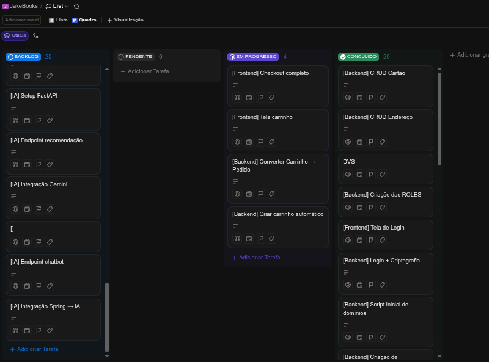

---
# Demonstração
> Lista de Livros

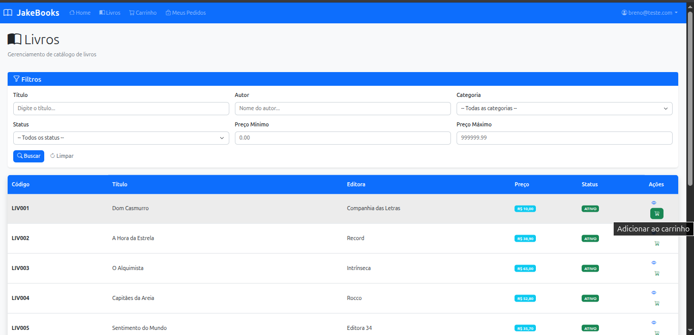

---
# Demonstração
> Carrinho

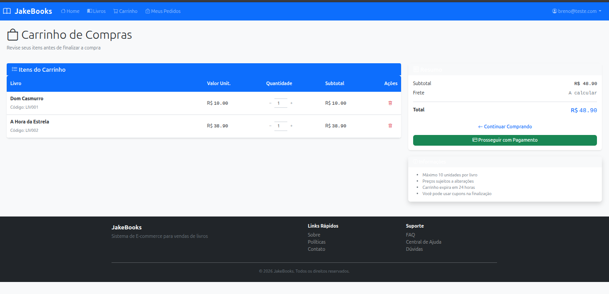

---

# Demonstração
> Checkout com seleção de endereço e pagamento com multiplos cartões


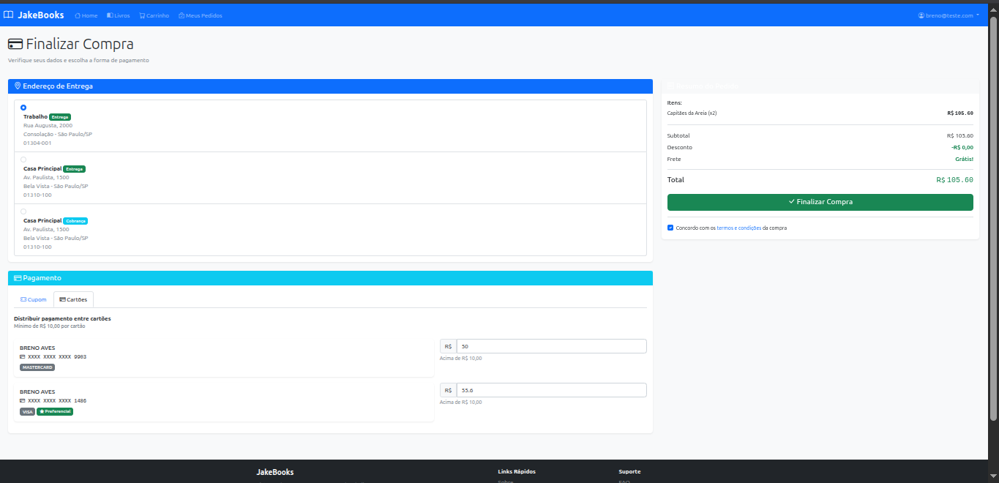

---

# Demonstração
> Pedido Criado


---

# Entrega 05 – 13/04/2026
## UseCase: Condução de Vendas (CDU01)

**O que foi feito:**
- Documentação completa do caso de uso com 32 fluxos (1 principal + 11 alternativos + 20 exceções)
- 8 protótipos HTML/CSS interativos (catálogo, carrinho, checkout, confirmação, admin)
- Pós-condições, 18 requisitos não-funcionais, pontos de extensão e 4 diagramas Mermaid

**Como foi feito:**
- Análise completa do documento de requisitos
- Criação de protótipos com HTML semântico e CSS puro (sem frameworks)
- Documentação estruturada com 949 linhas incluindo regras de negócio e fluxos

**Resumo técnico:**
O UseCase documenta o fluxo completo de compra de livros, desde navegação no catálogo até entrega e trocas, cobrindo múltiplos meios de pagamento, gestão de estoque, cupons e tratamento de exceções. Pronto para desenvolvimento backend.

---

# Entrega 06 – 27/04/2026
## Teste automatizado - Fluxo de Venda

---
# Kanban de Tarefas
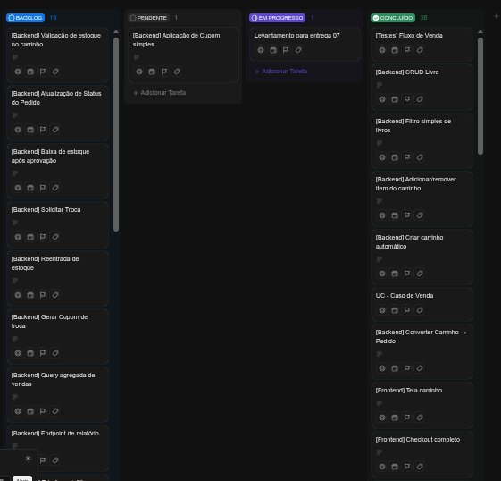

---

# Desenvolvimento: Teste E2E (Selenium)

**Funcionalidades:**
-  10 testes automatizados (Login, Carrinho, Checkout, Pagamento)
-  Scroll automático para elementos fora de viewport
-  Logging detalhado em arquivo + console
-  Relatório final com testes aprovados/falhados

---

# Demonstração
> Logs do teste E2E - Login e tentativas

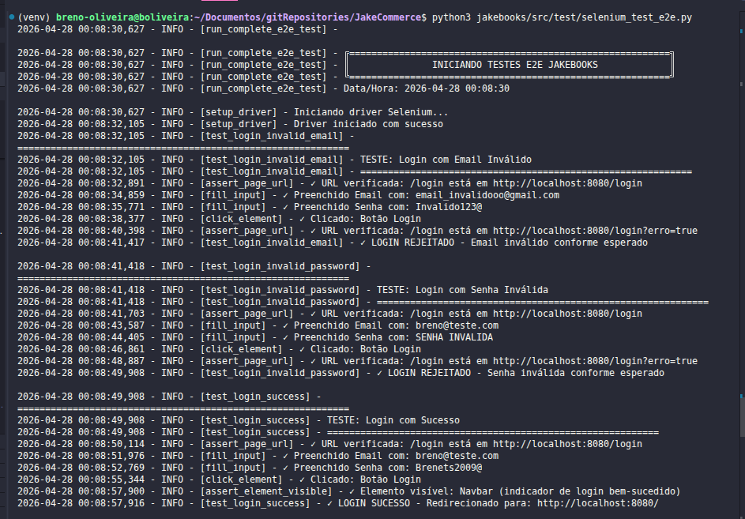

---
> Logs do teste E2E - Interação com carrinho

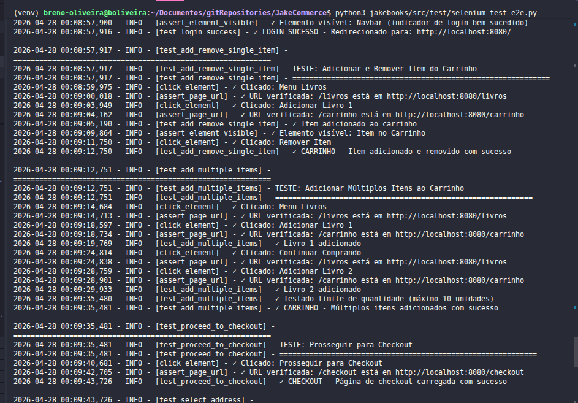

---
> Logs do teste E2E - Checkout e pagamento

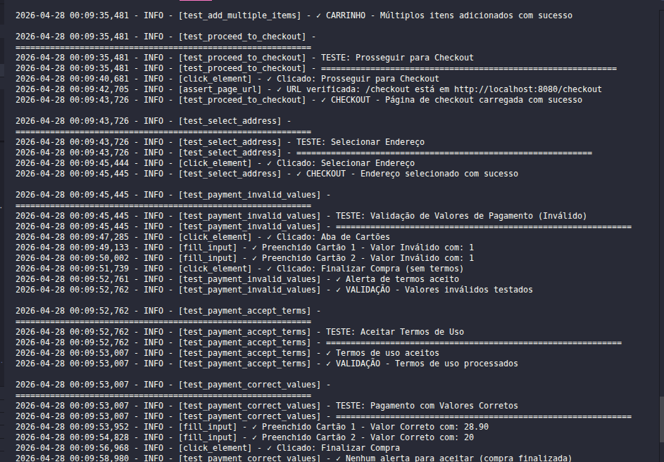

---
> Logs do teste E2E - Finalização e Relatório

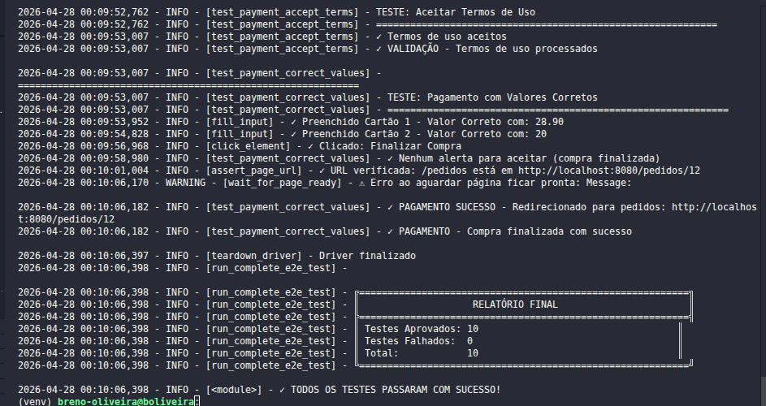

---

Entrega 07 – 18/05/2026
- Caso de uso de venda completo

---
# Kanban de Tarefas
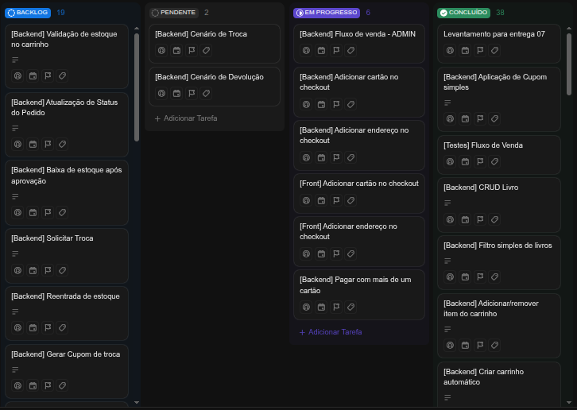

---
# Tarefas concluidas
✅ Cliente realizar compra;
✅ Cliente pagar com todas possíveis combinações de meio de pagamento (uso de diferentes cartões e cupons);
✅ Cliente pode registrar novo cartão e novo endereço de entrega no ato da compra;
Usuário pode solicitar troca ou devolução de um item do pedido ou do pedido completo;

---
# Tarefas concluidas
✅ O administrador confirma o pagamento;
O administrador aceitar ou negar a troca / devolução;
✅ O administrador define que o produto está EM TRANSPORTE;
✅ O administrador confirma o recebimento do produto devolvido;
✅ O sistema gerar cupom de troca;
✅ O administrador confirma que o produto foi ENTREGUE;
Deverá ser apresentado por meio de um teste automatizado para cada cenário de caso de uso.

---
# Logs dos Testes Unitários
## Carrinho
```bash
(venv) breno-oliveira@boliveira:~/Documentos/gitRepositories/JakeCommerce/jakebooks$ python src/test/run_orchestrator.py 
2026-06-01 22:21:00,381 ORCHESTRATOR INFO ======================================================================
2026-06-01 22:21:00,382 ORCHESTRATOR INFO INICIANDO SUITE DE TESTES E2E DO JAKEBOOKS
2026-06-01 22:21:00,382 ORCHESTRATOR INFO Total de testes a executar: 5
2026-06-01 22:21:00,382 ORCHESTRATOR INFO ======================================================================
2026-06-01 22:21:00,382 ORCHESTRATOR INFO Validando existência dos arquivos de teste...
2026-06-01 22:21:00,382 ORCHESTRATOR INFO   [1] ✓ 1.test_compra_cliente.py
2026-06-01 22:21:00,383 ORCHESTRATOR INFO   [2] ✓ 2.test_despacho_pedidos_admin.py
2026-06-01 22:21:00,383 ORCHESTRATOR INFO   [3] ✓ 3.test_solicitar_troca_cliente.py
2026-06-01 22:21:00,383 ORCHESTRATOR INFO   [4] ✓ 4.test_autorizar_troca_e_despacho_admin.py
2026-06-01 22:21:00,383 ORCHESTRATOR INFO   [5] ✓ 5.test_usando_cupom_troca_cliente.py
2026-06-01 22:21:00,383 ORCHESTRATOR INFO ----------------------------------------------------------------------
2026-06-01 22:21:00,384 ORCHESTRATOR INFO [1/5] Iniciando: 1.test_compra_cliente.py
2026-06-01 22:21:00,384 ORCHESTRATOR INFO Objetivo: Compra de livros pelo cliente
2026-06-01 22:21:02,539 INFO Test 1: iniciar teste de compra de cliente
2026-06-01 22:21:09,612 INFO 1: navegado para homepage
2026-06-01 22:21:10,309 INFO 1: clique no link de Login
2026-06-01 22:21:16,441 INFO 1: submeteu credenciais e clicou Entrar
2026-06-01 22:21:20,057 INFO 1: navegou para Livros
2026-06-01 22:21:40,328 INFO 1: Finalizou compra (clicou Finalizar Compra)
2026-06-01 22:21:44,562 ORCHESTRATOR INFO ✓ 1.test_compra_cliente.py PASSOU (tempo: 44.2s)
2026-06-01 22:21:44,562 ORCHESTRATOR INFO Aguardando 3s antes do próximo teste...
```

---
## Teste de Compra de Cliente - Logs
```bash
2026-06-01 22:21:00,384 ORCHESTRATOR INFO [1/5] Iniciando: 1.test_compra_cliente.py
2026-06-01 22:21:00,384 ORCHESTRATOR INFO Objetivo: Compra de livros pelo cliente
2026-06-01 22:21:02,539 INFO Test 1: iniciar teste de compra de cliente
2026-06-01 22:21:09,612 INFO 1: navegado para homepage
2026-06-01 22:21:10,309 INFO 1: clique no link de Login
2026-06-01 22:21:16,441 INFO 1: submeteu credenciais e clicou Entrar
2026-06-01 22:21:20,057 INFO 1: navegou para Livros
2026-06-01 22:21:40,328 INFO 1: Finalizou compra (clicou Finalizar Compra)
2026-06-01 22:21:44,562 ORCHESTRATOR INFO ✓ 1.test_compra_cliente.py PASSOU (tempo: 44.2s)
2026-06-01 22:21:44,562 ORCHESTRATOR INFO Aguardando 3s antes do próximo teste...
```
---
## Teste de Despacho de Pedidos Admin - Logs
```bash
2026-06-01 22:21:47,563 ORCHESTRATOR INFO [2/5] Iniciando: 2.test_despacho_pedidos_admin.py
2026-06-01 22:21:47,563 ORCHESTRATOR INFO Objetivo: Despacho de pedidos pelo admin
2026-06-01 22:21:49,608 INFO Test 2: iniciar teste de despacho de pedidos (admin)
2026-06-01 22:21:52,004 INFO 2: aberto /login
2026-06-01 22:21:55,168 INFO 2: fez login como admin
2026-06-01 22:21:58,823 INFO 2: navegou para pedido 12
2026-06-01 22:22:02,824 INFO 2: clicou Despachar Pedido
2026-06-01 22:22:07,060 INFO 2: clicou Confirmar Entrega
2026-06-01 22:22:10,975 INFO Test 2: finalizado
2026-06-01 22:22:11,089 ORCHESTRATOR INFO ✓ 2.test_despacho_pedidos_admin.py PASSOU (tempo: 23.5s)
2026-06-01 22:22:11,089 ORCHESTRATOR INFO Aguardando 3s antes do próximo teste...
```
---
## Teste de Solicitação de Troca pelo Cliente - Logs
```bash
2026-06-01 22:22:14,090 ORCHESTRATOR INFO [3/5] Iniciando: 3.test_solicitar_troca_cliente.py
2026-06-01 22:22:14,090 ORCHESTRATOR INFO Objetivo: Solicitação de troca pelo cliente
2026-06-01 22:22:15,532 INFO Test 3: iniciar teste de solicitar troca (cliente)
2026-06-01 22:22:17,512 INFO 3: aberto pagina do pedido 12
2026-06-01 22:22:26,474 INFO 3: clicou Solicitar Troca
2026-06-01 22:22:29,720 INFO Test 3: finalizado
2026-06-01 22:22:29,881 ORCHESTRATOR INFO ✓ 3.test_solicitar_troca_cliente.py PASSOU (tempo: 15.8s)
2026-06-01 22:22:29,882 ORCHESTRATOR INFO Aguardando 3s antes do próximo teste...
```
---
## Teste de Autorizar Troca e Despacho pelo Admin - Logs
```bash
2026-06-01 22:22:32,882 ORCHESTRATOR INFO [4/5] Iniciando: 4.test_autorizar_troca_e_despacho_admin.py
2026-06-01 22:22:32,883 ORCHESTRATOR INFO Objetivo: Autorização e recebimento de troca pelo admin
2026-06-01 22:22:34,541 INFO Test 4: iniciar teste autorizar troca e despacho (admin)
2026-06-01 22:22:36,988 INFO 4: aberto /login
2026-06-01 22:22:37,491 INFO 4: email preenchido: admin@jakebooks.com
2026-06-01 22:22:37,708 INFO 4: senha preenchida
2026-06-01 22:22:39,494 INFO 4: clicou Entrar
2026-06-01 22:22:42,831 INFO 4: navegou para /admin/trocas
2026-06-01 22:22:46,095 INFO 4: abriu Detalhes da troca
2026-06-01 22:22:46,095 INFO 4: prestes a clicar Autorizar Troca
2026-06-01 22:22:46,906 INFO 4: clicou Autorizar Troca
2026-06-01 22:22:49,907 INFO 4: prestes a clicar Confirmar Recebimento
2026-06-01 22:22:50,249 INFO 4: clicou Confirmar Recebimento
2026-06-01 22:22:50,870 INFO 4: troca capturada e salva: TROCA-B8C53CE8
2026-06-01 22:22:51,435 ORCHESTRATOR INFO ✓ 4.test_autorizar_troca_e_despacho_admin.py PASSOU (tempo: 18.6s)
2026-06-01 22:22:51,435 ORCHESTRATOR INFO Validando arquivo compartilhado gerado pelo teste 4...
2026-06-01 22:22:52,436 ORCHESTRATOR INFO ✓ Cupom de troca capturado com sucesso: TROCA-B8C53CE8
2026-06-01 22:22:52,436 ORCHESTRATOR INFO Aguardando 3s antes do próximo teste...
```
---
## Teste de Uso de Cupom de Troca pelo Cliente - Logs
```bash
2026-06-01 22:22:55,437 ORCHESTRATOR INFO [5/5] Iniciando: 5.test_usando_cupom_troca_cliente.py
2026-06-01 22:22:55,437 ORCHESTRATOR INFO Objetivo: Uso do cupom de troca para nova compra
2026-06-01 22:22:57,238 INFO Test 5: iniciar teste usando cupom de troca
2026-06-01 22:22:57,239 INFO 5: cupom carregado do arquivo compartilhado: TROCA-B8C53CE8
2026-06-01 22:22:59,709 INFO 5: aberto /login
2026-06-01 22:23:01,710 INFO 5: fez login
2026-06-01 22:23:05,140 INFO 5: navegou para Livros
2026-06-01 22:23:10,752 INFO 5: abriu checkout
2026-06-01 22:23:14,005 INFO 5: cupom aplicado no formulário: TROCA-B8C53CE8
2026-06-01 22:23:18,544 INFO 5: finalizou compra
2026-06-01 22:23:21,855 INFO Test 5: finalizado
2026-06-01 22:23:21,980 ORCHESTRATOR INFO ✓ 5.test_usando_cupom_troca_cliente.py PASSOU (tempo: 26.5s)
2026-06-01 22:23:21,980 ORCHESTRATOR INFO ======================================================================
2026-06-01 22:23:21,980 ORCHESTRATOR INFO ✓ TODOS OS TESTES PASSARAM COM SUCESSO!
2026-06-01 22:23:21,980 ORCHESTRATOR INFO ======================================================================
```
--- 
# Entrega 08 – 01/06/2026
## Integração com ChatBot de IA
- Modelo: Gemini

---
# Kanban
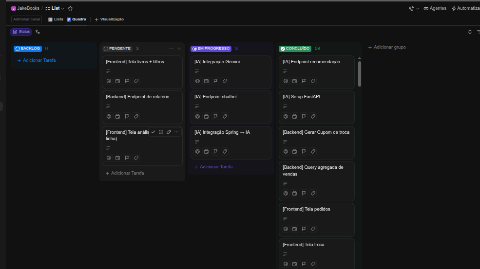

---
# Demonstração
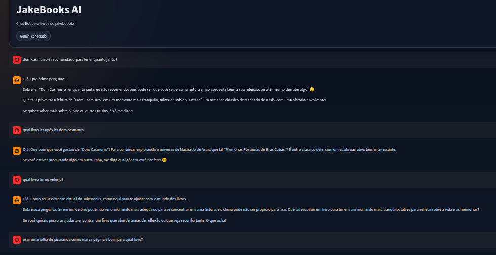

---
# Demonstração
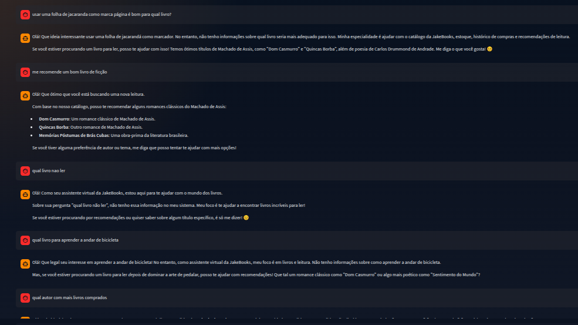   