# JakeBooks
#### Paixão por Livros e Salsichinhas
###### por: Breno de Oliveira

---
# Entrega 01 – 02/03/2026  
## E-Commerce de Livros: JakeBooks

**Tecnologias Utilizadas**

- **Backend:** Java 21 + Spring Boot  
- **Frontend:** Thymeleaf + Bootstrap  
- **Banco de Dados:** PostgreSQL  
- **Integração de IA:** Microserviço em Python
- **IA no Desenvolvimento:** Projects no ChatGPT  

---
# Estimativa
##### Backend
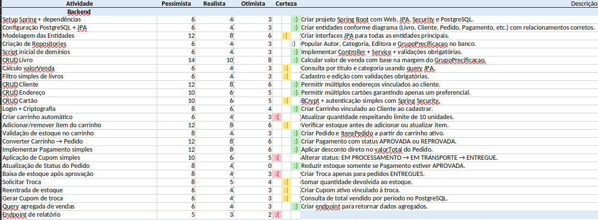

---
# Estimativa
##### Frontend + IA

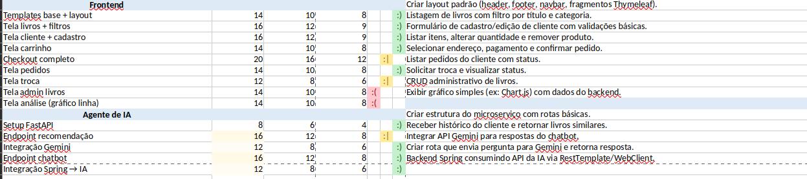

---

# Requisitos Funcionais Sugeridos

| ID        | Nome                              | Descrição                                                                                                                         |
| -------   | --------------------------------- | --------------------------------------------------------------                                                                                                                                          |
| RN0063 | Limite de livros                  | Um cliente pode comprar no máximo 10 unidades do mesmo livro por pedido.                                                          |
| RN0064 | Pedido mínimo                     | O pedido deve possuir valor mínimo de R$ 20,00 (sem frete) para poder ser finalizado.                                             | 
|  RN0065 | Cliente inadimplente              | Cliente que possuir 3 pedidos REPROVADOS consecutivos por pagamento terá o carrinho bloqueado temporariamente.                    |

---
# Fluxo Protótipo
> Catálogo

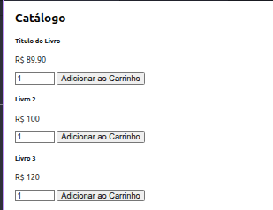

---
# Fluxo Protótipo
> Carrinho

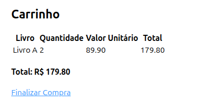

---
# Fluxo Protótipo
> Checkout

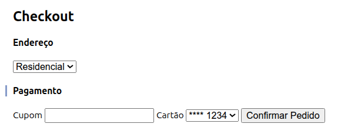

---
# Fluxo Protótipo
> Detalhe do Pedido

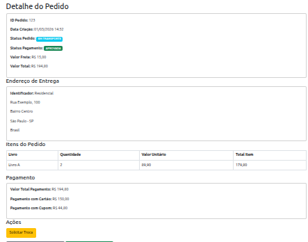

---

# Entrega 02 – 23/03/2026
## CRUD de Clientes

**Escopo da entrega:**
- Cadastro, consulta, alteração e inativação de clientes
- Gestão de endereços e cartões
- Alteração de senha com validação
---
# Kanban de Tarefas
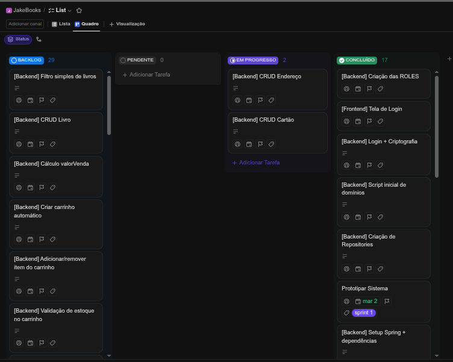

---

# Requisitos Funcionais Implementados

| RF | Descrição |
|---|---|
| RF0021 | Cadastrar cliente |
| RF0022 | Alterar cliente |
| RF0023 | Inativar cliente |
| RF0024 | Consultar cliente |
| RF0025 | Consultar transações do cliente |
| RF0026 | Cadastrar múltiplos endereços |
| RF0027 | Cadastrar múltiplos cartões (preferencial) |
| RF0028 | Alterar apenas senha |

---

# Regras de Negócio Contempladas

| RN | Descrição |
|---|---|
| RN0023 | Campos obrigatórios do endereço |
| RN0024 | Campos obrigatórios do cartão |
| RN0025 | Bandeira deve estar cadastrada |
| RN0026 | Dados obrigatórios do cliente |
| RN0027 | Cliente possui ranking numérico |

**Segurança:** Senha forte (8+ chars, maiúsc., minúsc., especiais) + BCrypt

---

# Demonstração
> Lista de Clientes

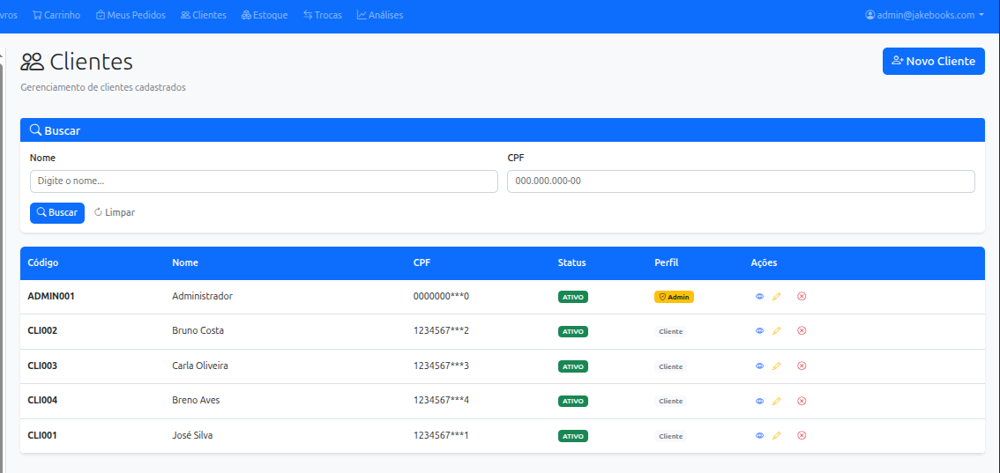

---

# Demonstração
> Detalhe do Cliente

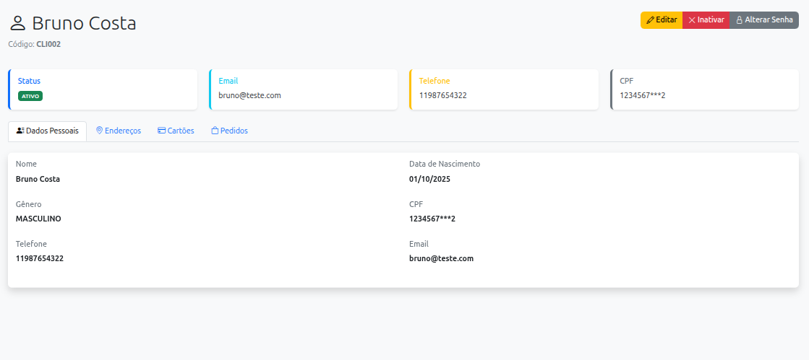

---

# Demonstração
> Cadastro de Cliente

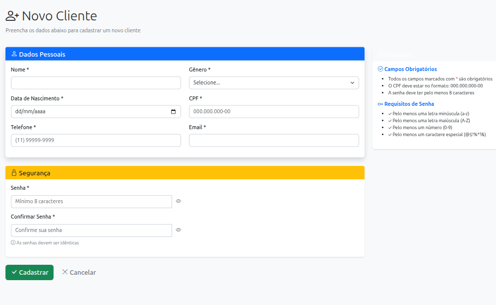

---
# Demonstração
> Cadastro de Endereço do Cliente

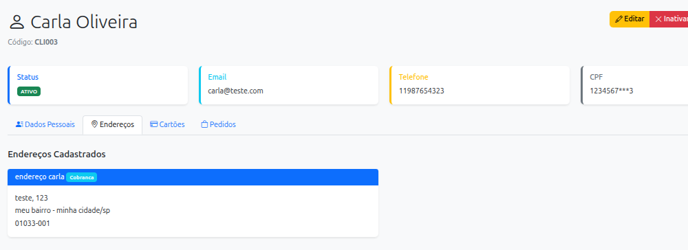

---

# Demonstração
> Cadastro de Cartão do Cliente

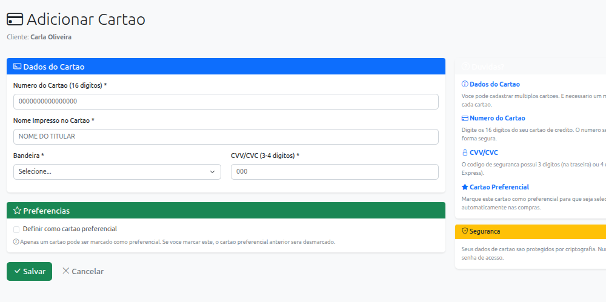
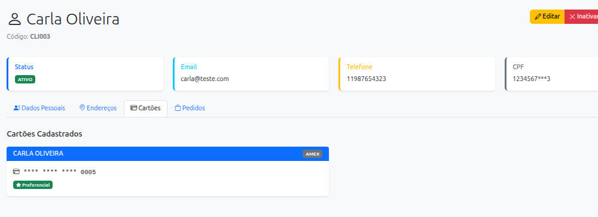

---

# Entrega 03 – 30/03/2026
## Documento de Visão de Projeto

**Escopo da entrega:**
- Formalização do DVP do sistema JakeBooks
- Autor: Breno Oliveira | Revisor: Rodrigo Rocha

---
# Kanban de Tarefas
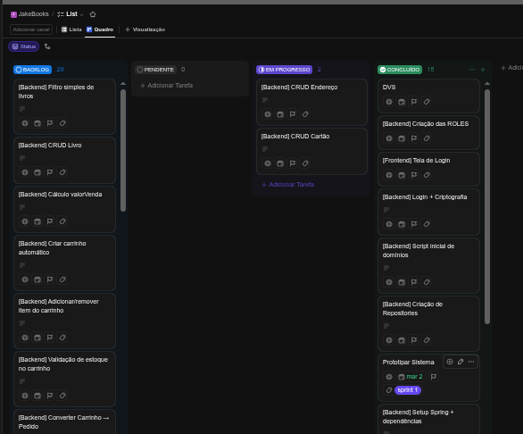